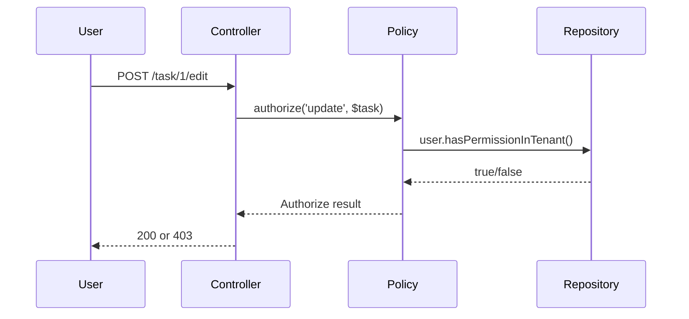

# Documentation Standard & Guidelines

**Version:** 1.0  
**Last Updated:** 2026-06-04  
**Status:** Active

---

## Purpose

Establish consistent, high-quality documentation that serves as a single source of truth for product design, architecture, and implementation.

---

## 📋 Document Types

### 1. **00-OVERVIEW.md** (Executive Summary)
- **Length:** 1-2 pages
- **Audience:** Everyone (product, engineering, stakeholders)
- **Purpose:** Why does this feature exist? What problem does it solve?
- **Contents:**
  - Problem statement
  - Business value
  - Key metrics/success criteria
  - Scope (what's in/out)
  - Timeline estimate

**Template:**
```markdown
# Feature Name — Overview

## Problem Statement
[Why do we need this?]

## Solution Summary
[What are we building?]

## Business Value
- Metric 1: Expected impact
- Metric 2: Expected impact

## Scope
**In Scope:**
- Item 1
- Item 2

**Out of Scope:**
- Item 1
- Item 2

## Timeline
- Design: X days
- Implementation: Y days
- Testing: Z days
```

---

### 2. **01-REQUIREMENTS.md** (Detailed Requirements)
- **Length:** 2-3 pages
- **Audience:** Product, Engineering Leads
- **Purpose:** Define exactly what needs to be built
- **Contents:**
  - Functional requirements (user stories)
  - Non-functional requirements (performance, security, etc)
  - Constraints & assumptions
  - Dependencies
  - Success criteria (testable)

**Template:**
```markdown
# Feature Name — Requirements

## Functional Requirements

### F1: Role Management
- Users with "owner" role can create/edit/delete roles
- Roles are scoped to tenant (isolated)
- Each role has 0+ permissions

### F2: Permission Checking
- System must check user permission before action
- Check happens at 3 levels: route, controller, policy

## Non-Functional Requirements

### Performance
- Permission check: < 10ms per request
- Cache hits: > 90%

### Security
- No cross-tenant permission leaks
- Permissions audit-logged

### Scalability
- Support 1000+ roles per tenant
- Support 10,000+ users per tenant

## Constraints
- Must use existing Laravel (v13)
- Must use spatie/laravel-permission
- Multi-tenant must be explicit (no magic)

## Dependencies
- Spatie package (installed)
- Redis for caching (available)

## Success Criteria
- [ ] Users cannot access resources outside their tenant
- [ ] Permission matrix covers all actions
- [ ] Tests pass (>90% coverage)
```

---

### 3. **02-ARCHITECTURE.md** (How It Works)
- **Length:** 3-5 pages
- **Audience:** Engineers, architects
- **Purpose:** Design decisions, system interactions, diagrams
- **Contents:**
  - Data model (ER diagram)
  - System interactions (flow diagrams)
  - Layer responsibilities (diagram)
  - Design patterns used
  - Technology choices & rationale

**Template:**
```markdown
# Feature Name — Architecture

## Data Model

[Mermaid ER Diagram]

## System Interactions

### Permission Check Flow

[Mermaid sequence diagram]

## Layer Responsibilities

[Mermaid architecture diagram]

Domain → Application → Infrastructure → Presentation

## Design Patterns

- **Pattern 1:** Policy-based authorization
- **Pattern 2:** Tenant scoping with explicit tenant_id

## Technology Choices

| Component | Choice | Why |
|---|---|---|
| Library | spatie/laravel-permission | Industry standard |
| Caching | Redis tags | Tenant-safe invalidation |
| Scoping | Explicit tenant_id | Safety > convenience |

## File Structure

```
app/
├── Models/
│   ├── Role.php (extended)
│   └── Permission.php (extended)
├── Policies/
│   ├── TaskPolicy.php
│   ├── ProjectPolicy.php
│   └── TenantPolicy.php
└── Http/
    └── Middleware/
        └── TenantScopedPermission.php
```
```

---

### 4. **03-APPROACHES.md** (Options & Decision)
- **Length:** 3-4 pages
- **Audience:** Decision makers, architects
- **Purpose:** Compare multiple approaches, justify selection
- **Contents:**
  - Option A: Simple approach (pros/cons)
  - Option B: Recommended (pros/cons)
  - Option C: Advanced (pros/cons)
  - Comparison table
  - Final recommendation & reasoning

**Template:**
```markdown
# Feature Name — Approaches & Decision

## Option A: Simple Approach

**Concept:** [Brief description]

**Pros:**
- ✅ Pro 1
- ✅ Pro 2

**Cons:**
- ❌ Con 1
- ❌ Con 2

**Suitable for:** [Scenario]

---

## Option B: Recommended ✅

[Same structure]

## Option C: Advanced

[Same structure]

---

## Comparison

| Aspect | A | B | C |
|---|---|---|---|
| Complexity | 🟢 | 🟡 | 🔴 |
| Time | 1-2 days | 2-3 days | 3-4 days |

---

## Decision: Option B

**Reasoning:**
[Why B is best for THIS project]
```

---

### 5. **04-IMPLEMENTATION_PLAN.md** (Step-by-Step)
- **Length:** 5-10 pages
- **Audience:** Engineers implementing
- **Purpose:** Actionable, detailed steps to build the feature
- **Contents:**
  - Phase breakdown (days/milestones)
  - Step-by-step instructions
  - Code snippets
  - File locations
  - Checklist
  - Testing strategy
  - Rollback plan

**Template:**
```markdown
# Feature Name — Implementation Plan (Approach B)

## Overview: 4 Phases, 3 Days

```
Phase 1: Setup (Day 1 morning)
    ↓
Phase 2: Core Logic (Day 1 afternoon)
    ↓
Phase 3: Integration (Day 2)
    ↓
Phase 4: UI & Testing (Day 2-3)
```

## Phase 1: Setup

### Step 1.1: Create Migration

**File:** `database/migrations/2026_06_04_000000_add_feature.php`

[Code snippet]

### Step 1.2: Create Model

**File:** `app/Models/FeatureName.php`

[Code snippet]

## Phase 2: [etc]

## Checklist

- [ ] Phase 1 Day 1 morning
- [ ] Phase 1 Day 1 afternoon

## Deployment & Rollback

[Risk mitigation, rollback steps]
```

---

## 📐 Diagram Standards

### Mermaid Diagram Types

**Use for:**
- ER diagrams (data model): `erDiagram`
- Sequence diagrams (interactions): `sequenceDiagram`
- Flow diagrams (process): `flowchart`
- Architecture (layers): `graph`
- Timeline: `gantt`

**Rules:**
1. Every diagram must have a title and caption
2. Keep diagrams simple (max 10 elements)
3. Label clearly
4. Test diagram renders (Mermaid syntax)

**Example:**
````markdown


**Caption:** Permission check flow in the authorization layer
````

---

## ✍️ Writing Standards

### Tone & Voice
- **Professional** but not stiff
- **Clear** over clever
- **Active voice** (avoid passive)
- **Second person** for instructions ("you will", "you need")

### Structure
- **Headings:** Use H1 for titles, H2 for sections, H3 for subsections
- **Lists:** Bullet points for unordered, numbers for sequences
- **Tables:** Use for comparisons
- **Code:** Use triple backticks with language (```php)

### Cross-References
- Link to other docs: `[Resource Name](../path/to/doc.md)`
- Link to code: `[UserPolicy.php](../../app/Policies/UserPolicy.php#L15)`
- Link to external: `[Spatie Docs](https://spatie.be/...)`

### Emphasis
- **Bold** for important concepts
- *Italic* for variables/placeholder names
- `Code` for file paths, variable names, commands
- > Blockquotes for warnings/important notes

**Example:**
```markdown
> ⚠️ **Warning:** Never expose tenant_id in URLs without validation

The permission check happens at the **Policy** layer using the
`hasPermissionInTenant()` method defined in `app/Models/User.php`.
```

---

## 📅 Version Control

Every document should include:

```markdown
---
Version: X.Y
Last Updated: YYYY-MM-DD
Status: [Draft | Review | Approved | Active | Archived]
Author: [Name]
---
```

When updating:
- Increment version (1.0 → 1.1 for edits, 2.0 for major rewrites)
- Add entry to version history table
- Link to related PRs/commits

---

## 🔍 Review Checklist

Before submitting docs for review:

- [ ] All sections filled out (no TODOs)
- [ ] Diagrams present and render correctly
- [ ] Code examples are tested/working
- [ ] Links are correct (no 404s)
- [ ] No placeholder text
- [ ] Consistent formatting
- [ ] Proofread for typos
- [ ] Version info filled
- [ ] Ownership assigned

---

## 📊 Review & Approval Process

```
Draft: Author
    ↓
Review: Tech Lead reviews for clarity & accuracy
    ↓
Approval: Architecture Lead approves design
    ↓
Implementation: Team codes based on approved docs
    ↓
Update: Docs updated with actual implementation notes
    ↓
Archive: Completed features moved to archive
```

**Review SLA:** 2-3 business days

---

## 🗂️ Maintenance

### When to Update Docs
- Design changes (must update before coding)
- New requirements discovered
- Architecture decisions change
- Lessons learned post-implementation

### When to Archive
- Feature shipped to production
- Feature deprecated
- Old approach no longer relevant

**Archived docs stay in:** `docs/archive/[year]/FEATURE_NAME/`

---

## 📌 Quick Reference

| Need | Use This |
|---|---|
| Understanding a feature | 00-OVERVIEW |
| Building the feature | 04-IMPLEMENTATION_PLAN |
| Evaluating options | 03-APPROACHES |
| System design | 02-ARCHITECTURE |
| Specific requirements | 01-REQUIREMENTS |

---

## Questions?

- **How do I start a new feature?** → Copy template from section 2 above
- **What if requirements change?** → Update 01-REQUIREMENTS, then 04-PLAN
- **How detailed should diagrams be?** → Detailed enough to understand, simple enough to read
- **Can I skip a section?** → No. All 4 sections required before approval.

---

## Version History

| Version | Date | Change | Author |
|---|---|---|---|
| 1.0 | 2026-06-04 | Initial standard | Architecture |

