# Database Schema — ER Diagram

> Sinh từ `database/migrations/*` (tính tới migration `2026_06_10_102918_create_tenant_settings_table.php`).
> Cập nhật file này mỗi khi thêm/sửa migration ảnh hưởng tới cấu trúc bảng.

---

## ER Diagram

```mermaid
erDiagram
    TENANTS {
        bigint id PK
        string name
        string slug UK
        boolean is_active
        timestamp trial_ends_at
        json settings
        timestamp deleted_at "soft delete"
    }

    USERS {
        bigint id PK
        string name
        string email UK
        timestamp email_verified_at
        string password
    }

    TENANT_USER {
        bigint id PK
        bigint tenant_id FK
        bigint user_id FK
        string role
    }

    PROJECTS {
        bigint id PK
        bigint tenant_id FK
        bigint onwer_id FK "→ users (typo: onwer_id)"
        string name
        text description
        string status
        timestamp deleted_at "soft delete"
    }

    TASKS {
        bigint id PK
        bigint tenant_id FK
        bigint project_id FK
        bigint created_by FK "→ users"
        bigint assignee_id FK "→ users, nullable"
        string title
        text description
        enum status "todo/in_progress/in_review/done"
        enum priority "low/medium/high/critical"
        int order
        date due_date
        timestamp completed_at
        timestamp deleted_at "soft delete"
    }

    TASK_COMMENTS {
        bigint id PK
        bigint tenant_id FK
        bigint task_id FK
        bigint user_id FK
        text content
        timestamp deleted_at "soft delete"
    }

    TASK_ATTACHMENTS {
        bigint id PK
        bigint tenant_id FK
        bigint task_id FK
        bigint uploaded_by FK "→ users"
        string original_name
        string storage_path
        string mime_type
        int size_bytes
    }

    TASK_ACTIVITIES {
        bigint id PK
        bigint tenant_id FK
        bigint task_id FK
        bigint user_id FK
        string action
        json payload
    }

    NOTIFICATIONS {
        bigint id PK
        bigint tenant_id FK
        bigint user_id FK
        string event
        string title
        text body
        string url
        boolean is_read
        timestamp read_at
        json data
    }

    TENANT_SETTINGS {
        bigint id PK
        bigint tenant_id FK
        string key
        json value
    }

    USER_META {
        bigint id PK
        bigint user_id FK
        string key
        text value
    }

    AUDIT_LOGS {
        bigint id PK
        bigint tenant_id "nullable, no FK constraint"
        bigint user_id "nullable, no FK constraint"
        string action
        string entity_type
        bigint entity_id
        json old_values
        json new_values
        string ip_address
        text user_agent
        json metadata
        timestamp created_at "immutable, no updated_at"
    }

    ROLES {
        bigint id PK
        string name
        string guard_name
        bigint tenant_id "nullable, custom add-on"
    }

    PERMISSIONS {
        bigint id PK
        string name
        string guard_name
        bigint tenant_id "nullable, custom add-on"
    }

    MODEL_HAS_ROLES {
        bigint role_id FK
        string model_type
        bigint model_id
        bigint tenant_id "nullable, custom add-on"
    }

    MODEL_HAS_PERMISSIONS {
        bigint permission_id FK
        string model_type
        bigint model_id
        bigint tenant_id "nullable, custom add-on"
    }

    ROLE_HAS_PERMISSIONS {
        bigint role_id FK
        bigint permission_id FK
    }

    SESSIONS {
        string id PK
        bigint user_id FK
        string ip_address
        text user_agent
        int last_activity
    }

    %% ===== Relationships =====
    TENANTS ||--o{ TENANT_USER : "members"
    USERS ||--o{ TENANT_USER : "memberships"

    TENANTS ||--o{ PROJECTS : "owns"
    USERS ||--o{ PROJECTS : "created (onwer_id)"

    TENANTS ||--o{ TASKS : "scopes"
    PROJECTS ||--o{ TASKS : "has"
    USERS ||--o{ TASKS : "created_by"
    USERS ||--o{ TASKS : "assignee_id"

    TENANTS ||--o{ TASK_COMMENTS : "scopes"
    TASKS ||--o{ TASK_COMMENTS : "has"
    USERS ||--o{ TASK_COMMENTS : "writes"

    TENANTS ||--o{ TASK_ATTACHMENTS : "scopes"
    TASKS ||--o{ TASK_ATTACHMENTS : "has"
    USERS ||--o{ TASK_ATTACHMENTS : "uploaded_by"

    TENANTS ||--o{ TASK_ACTIVITIES : "scopes"
    TASKS ||--o{ TASK_ACTIVITIES : "has"
    USERS ||--o{ TASK_ACTIVITIES : "performs"

    TENANTS ||--o{ NOTIFICATIONS : "scopes"
    USERS ||--o{ NOTIFICATIONS : "receives"

    TENANTS ||--o{ TENANT_SETTINGS : "has"

    USERS ||--o{ USER_META : "has"
    USERS ||--o{ SESSIONS : "has"

    ROLES ||--o{ MODEL_HAS_ROLES : "assigned via"
    PERMISSIONS ||--o{ MODEL_HAS_PERMISSIONS : "assigned via"
    ROLES ||--o{ ROLE_HAS_PERMISSIONS : "has"
    PERMISSIONS ||--o{ ROLE_HAS_PERMISSIONS : "has"

    TENANTS ||--o{ ROLES : "scopes (nullable)"
    TENANTS ||--o{ PERMISSIONS : "scopes (nullable)"
    TENANTS ||--o{ AUDIT_LOGS : "logs (nullable)"
    USERS ||--o{ AUDIT_LOGS : "performs (nullable)"
```

---

## Nhóm bảng

- **Core tenancy:** `tenants` ↔ `users` qua pivot `tenant_user` (kèm `role`)
- **Project management:** `projects` → `tasks` → `task_comments` / `task_attachments` / `task_activities`, tất cả đều có `tenant_id` để scope
- **RBAC (Spatie permission, đã tenant-scoped):** `roles`, `permissions`, `model_has_roles`, `model_has_permissions`, `role_has_permissions` — `tenant_id` được thêm thủ công (nullable, không phải FK), unique constraint là `(name, guard_name, tenant_id)`
- **Audit & notification:** `audit_logs` (immutable, không có FK constraint trên `tenant_id`/`user_id`), `notifications`
- **Misc:** `user_meta` (key-value cho user), `tenant_settings` (key-value cho tenant), `sessions`

## Lưu ý / known issues

- `projects.onwer_id` bị **typo** (thiếu chữ "w") — đúng ra phải là `owner_id`. Cần cẩn thận khi tham chiếu cột này trong repository/model.
- `audit_logs.tenant_id` và `audit_logs.user_id` **không có foreign key constraint thật** (chỉ `unsignedBigInteger`, nullable) — khác với các bảng còn lại.
- `roles` / `permissions` / `model_has_roles` / `model_has_permissions` dùng cột `tenant_id` tự thêm qua migration riêng, **không dùng** tính năng "teams" của Spatie (`teams = false` trong `config/permission.php`).
