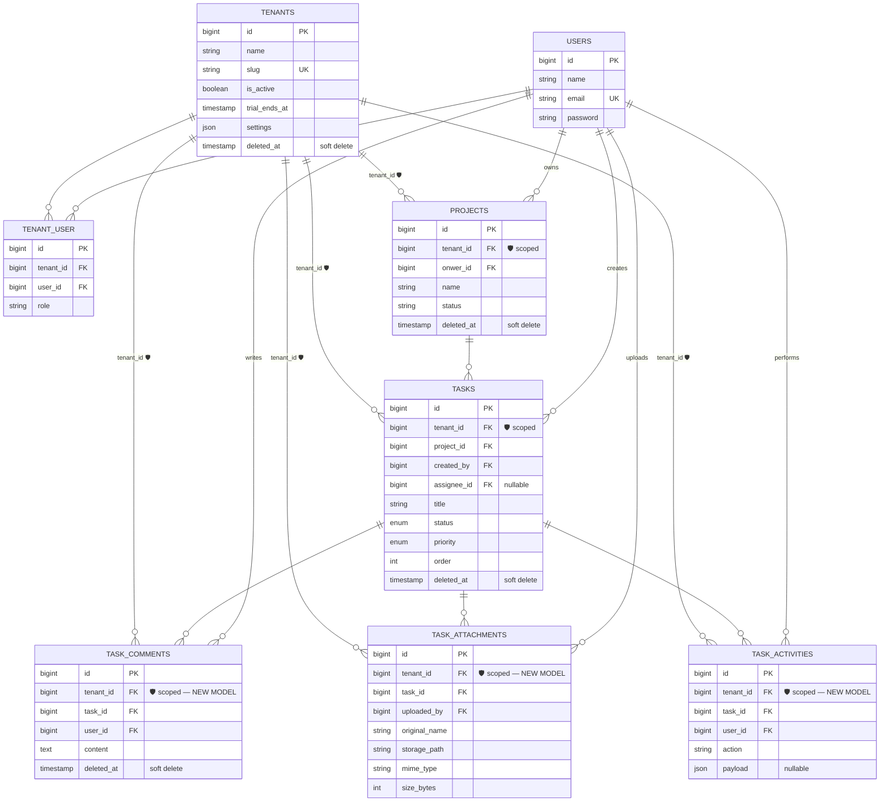
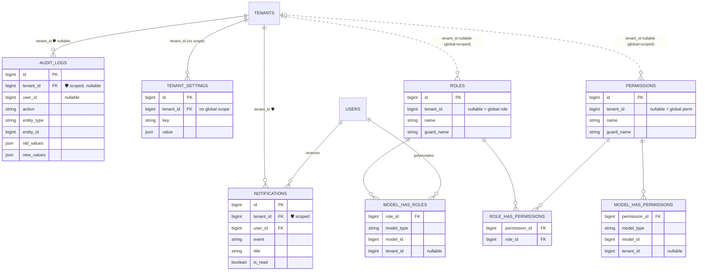
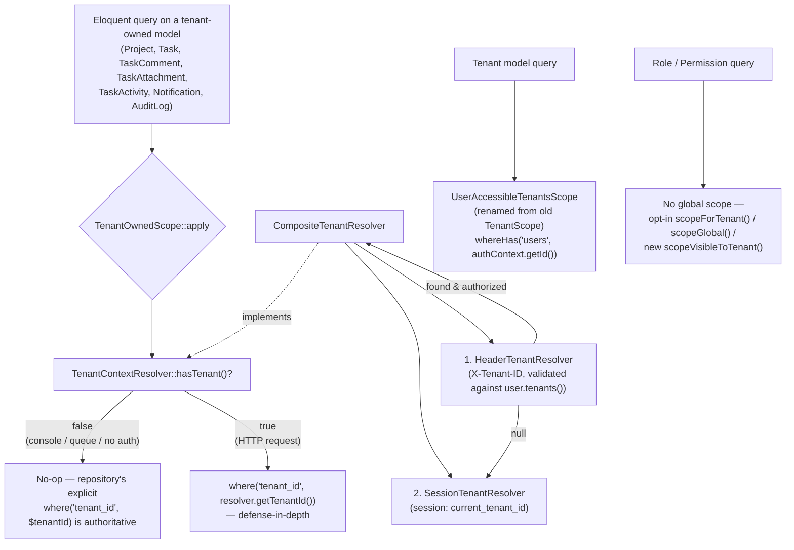

# Plan: Refactor Multi-Tenancy Database/ORM Architecture

## Context

The project currently scopes tenant data **only at the repository layer** — every repository method explicitly does `where('tenant_id', $tenantId)`, with `$tenantId` passed in from the UseCase (per Clean Architecture rules, never read from session inside UseCases). This works, but has no defense-in-depth: if any future code path calls `Task::find($id)`, `Notification::find($id)`, etc. directly (bypassing the repository), it returns data across tenants with zero protection.

There's also one **misused/broken global scope** today:

- `app/Models/Scopes/TenantScope.php` filters `whereHas('users', ...)` based on the **logged-in user** — correct for `Tenant` model ("which tenants can this user see"), but it's also attached to `TenantSetting`, which has **no `users()` relation** — this would throw if ever triggered. It's silently dead because `EloquentTenantSettingRepository` always calls `withoutGlobalScopes()`.

Plus 3 known bugs:
1. `Tenant::projects()` (app/Models/Tenant.php:39-41) is missing `return` — relation unusable.
2. `TenantSetting`'s scope (above) is broken/dead code.
3. `TenantContext::getId(): int` can actually return `null` from `session()` — type-lie that risks a `TypeError`.

**Goal:** Add a model-level "current tenant" global scope (`TenantOwnedScope`) as defense-in-depth for tenant-owned models (Project, Task, Notification, AuditLog, and new TaskComment/TaskAttachment/TaskActivity models), fix the 3 bugs, create the missing child models, and make the "current tenant" resolution mechanism extensible to API clients (header-based) — without breaking queue/console jobs (which have no session) or violating the Clean Architecture rule that UseCases receive `tenantId` explicitly.

**Critical safety property:** The new `TenantOwnedScope` must be a **no-op when there's no resolvable tenant context** (queue jobs, console commands, tinker). Repositories keep their explicit `where('tenant_id', ...)` filters as the authoritative filter in those contexts — the global scope is purely an extra safety net during HTTP requests.

---

## Design

### 1. Split the existing `TenantScope` into two distinct concepts

- **`app/Models/Scopes/UserAccessibleTenantsScope.php`** — renamed from current `TenantScope.php`. Same logic (`whereHas('users', ...)` filtered by `authContext()->getId()`), used **only by `Tenant`** model. Update the reference in `app/Models/Tenant.php`.
- **`app/Models/Scopes/TenantOwnedScope.php`** (new) — for tenant-owned records:
  ```php
  public function apply(Builder $builder, Model $model): void
  {
      $resolver = app(TenantContextResolver::class);
      if (! $resolver->hasTenant()) {
          return; // no-op: console/queue/unauthenticated — repos filter explicitly
      }
      $builder->where($model->getTable() . '.tenant_id', $resolver->getTenantId());
  }
  ```

### 2. New `TenantContextResolver` abstraction (API-ready, replaces session-only check)

- **`app/Shared/Tenant/TenantContextResolver.php`** — interface: `hasTenant(): bool`, `getTenantId(): ?int`.
- **`app/Shared/Tenant/SessionTenantResolver.php`** — current session-based logic, guarded with `app()->bound('session') && session()->isStarted()` so it safely returns `false`/`null` outside HTTP context.
- **`app/Shared/Tenant/HeaderTenantResolver.php`** — reads `X-Tenant-ID` header, validates the authenticated user belongs to that tenant via `$user->tenants()->where('tenants.id', $headerId)->exists()`. Returns `null` if missing/unauthorized (fails closed — defense-in-depth only, not a primary auth boundary).
- **`app/Shared/Tenant/CompositeTenantResolver.php`** — bound as singleton implementation of `TenantContextResolver`. Tries header first, falls back to session, memoizes per-request. Works correctly in all contexts (web, API, console/queue → both inner resolvers return `null` → no-op).
- Bind in `app/Providers/AppServiceProvider.php`: `$this->app->singleton(TenantContextResolver::class, CompositeTenantResolver::class);`

`TenantContext` (existing class) stays as the **write-side** API (`setId()`, `forget()`, `has()`, used by `SetDefaultTenant` middleware / tenant switcher). Make `SESSION_KEY` constant `public` so `SessionTenantResolver` can reuse it without duplicating the string.

### 3. New `BelongsToTenant` trait

**`app/Models/Concerns/BelongsToTenant.php`** (new directory):
```php
trait BelongsToTenant
{
    public static function bootBelongsToTenant(): void
    {
        static::addGlobalScope(new TenantOwnedScope);

        static::creating(function ($model) {
            if (empty($model->tenant_id)) {
                $resolver = app(TenantContextResolver::class);
                if ($resolver->hasTenant()) {
                    $model->tenant_id = $resolver->getTenantId();
                }
            }
        });
    }

    public function tenant(): BelongsTo
    {
        return $this->belongsTo(Tenant::class);
    }
}
```
The `creating` auto-fill is a safety net only — repositories already set `tenant_id` explicitly, so this never overrides their value.

### 4. RBAC (Role/Permission) — do NOT add global scope

`tenant_id` on `roles`/`permissions` is **nullable** (global roles use `NULL`). A `where('tenant_id', current)` global scope would hide all global roles and break Spatie's permission resolution. Instead:

- Add a new **opt-in local scope** `scopeVisibleToTenant(Builder $query, int $tenantId)` to `app/Models/Role.php` and `app/Models/Permission.php`:
  ```php
  public function scopeVisibleToTenant(Builder $query, int $tenantId): Builder
  {
      return $query->where(fn ($q) => $q->where('tenant_id', $tenantId)->orWhereNull('tenant_id'));
  }
  ```
- Leave existing `scopeForTenant()` / `scopeGlobal()` untouched. No changes to `model_has_roles`/`model_has_permissions` (Spatie-managed pivots, already filtered explicitly via `User::rolesForTenant()`).

### 5. New child models for Task

All three use `BelongsToTenant`:

- **`app/Models/TaskComment.php`** — `SoftDeletes` (table has `softDeletes()`), fillable: `tenant_id, task_id, user_id, content`, relations `task()`, `user()`.
- **`app/Models/TaskAttachment.php`** — no SoftDeletes, fillable: `tenant_id, task_id, uploaded_by, original_name, storage_path, mime_type, size_bytes`, relations `task()`, `uploader()` (`belongsTo(User::class, 'uploaded_by')`).
- **`app/Models/TaskActivity.php`** — no SoftDeletes, fillable: `tenant_id, task_id, user_id, action, payload`, cast `payload` → `array`, relations `task()`, `user()`.
- **`app/Models/Task.php`** — add `comments(): HasMany`, `attachments(): HasMany`, `activities(): HasMany`.

### 6. Bug fixes

1. **`app/Models/Tenant.php`** — fix `projects()`:
   ```php
   public function projects(): HasMany
   {
       return $this->hasMany(Project::class);
   }
   ```
   (add `use Illuminate\Database\Eloquent\Relations\HasMany;`)

2. **`app/Models/TenantSetting.php`** — remove the broken `booted()` override entirely (drop `use App\Models\Scopes\TenantScope` and the `static::addGlobalScope(...)` call). `TenantSetting` becomes scope-free, matching its actual `withoutGlobalScopes()` repository usage. **Do not** add `TenantOwnedScope` here either — adding it would mask bugs by silently no-op'ing instead of surfacing them, given the repo already fully controls filtering by `tenant_id`.

3. **`app/Shared/Tenant/TenantContext.php`** — fix `getId()`:
   ```php
   public function getId(): ?int
   {
       $id = session(self::SESSION_KEY);
       return $id !== null ? (int) $id : null;
   }
   ```
   Make `SESSION_KEY` `public const`. Existing callers (`ChooseCurrentTenant`'s `if (!$tenantId)`) already handle `null`/falsy correctly.

### 6.5 Database Structure Diagram (After Refactor)

**Core domain — tenant-owned tables (all carry `tenant_id`, scoped via `TenantOwnedScope`/`BelongsToTenant`):**



**Tenant infrastructure — notifications, audit, settings, RBAC:**



**Scope/resolver architecture (code-level, not DB):**



🛡 = `BelongsToTenant` trait → `TenantOwnedScope` global scope + auto-fill `tenant_id` on create.

---

### 7. Adoption matrix — which models get `BelongsToTenant`

| Model | Action | Notes |
|---|---|---|
| `Project` | Add trait, remove duplicate `tenant()` method | Low risk — repo already filters explicitly |
| `Task` | Add trait, remove duplicate `tenant()` method | Low risk — same |
| `TaskComment`, `TaskAttachment`, `TaskActivity` | New models, adopt from creation | Zero legacy risk |
| `Notification` | Add trait, remove duplicate `tenant()` method | Note: `EloquentNotificationRepository::markAsRead()` filters only by `user_id` (not `tenant_id`) — the new scope adds tenant filtering automatically during HTTP requests (extra safety); no-ops in queue context (unchanged behavior) |
| `AuditLog` | Add `TenantOwnedScope` only — **skip the `creating` auto-fill** (or apply trait but verify) | `tenant_id` is nullable in DB (`unsignedBigInteger('tenant_id')->nullable()`) for potential system-level/global events. `$guarded=['id']`, `$timestamps=false`. Written almost exclusively via queued `WriteAuditLogJob` which sets `tenant_id` explicitly — scope no-ops there. Verify no system-level (null tenant_id) audit writes happen during an authenticated HTTP request before final adoption. |
| `Tenant` | No change (keeps `UserAccessibleTenantsScope`) | Different concept entirely |
| `TenantSetting` | No change (scope removed per bug fix #2, stays scope-free) | Matches `withoutGlobalScopes()` repo pattern |
| `Role` / `Permission` | New opt-in `scopeVisibleToTenant()` only, no global scope | See section 4 |

---

## Rollout Phases

**Phase A — Foundation (additive, zero behavior change)**
- New: `app/Shared/Tenant/TenantContextResolver.php`, `SessionTenantResolver.php`, `HeaderTenantResolver.php`, `CompositeTenantResolver.php`
- New: `app/Models/Scopes/TenantOwnedScope.php`, `app/Models/Concerns/BelongsToTenant.php`
- Bind `TenantContextResolver` → `CompositeTenantResolver` in `AppServiceProvider::boot()`
- Bug fixes: `Tenant::projects()`, `TenantContext::getId()` nullable, rename `TenantScope` → `UserAccessibleTenantsScope`, remove broken scope from `TenantSetting`
- Nothing adopts the new scope/trait yet — full test suite (`composer run test`) should remain 100% green.

**Phase B — New child models (additive)**
- `TaskComment`, `TaskAttachment`, `TaskActivity` models + `Task` relations (`comments()`, `attachments()`, `activities()`)
- First real exercise of `BelongsToTenant`/`TenantOwnedScope`, in a context with no legacy queries to break.

**Phase C — Adopt on Project & Task (low risk)**
- Add `BelongsToTenant` to `Project` and `Task`, remove their duplicate `tenant()` methods.
- Run `tests/Feature/TaskPermissionTest.php` + manual smoke test (login as 2 different tenant users, verify isolation).

**Phase D — Adopt on Notification & AuditLog (medium risk)**
- `Notification`: add trait, remove duplicate `tenant()`.
- `AuditLog`: add `TenantOwnedScope` (verify nullable tenant_id edge case per adoption matrix).
- Critical regression check: queue jobs must still work — `WriteNotificationJob`, `WriteAuditLogJob` create/read records correctly with explicit `tenant_id` even though `TenantOwnedScope` is active (it no-ops outside HTTP context).

**Phase E — RBAC additive scope (independent, can run anytime after Phase A)**
- Add `scopeVisibleToTenant()` to `Role` and `Permission`. No existing behavior touched.

**Phase F — API tenant resolution (last)**
- `HeaderTenantResolver` already built in Phase A. Add a feature test: Sanctum-authenticated request + `X-Tenant-ID` header → tenant-owned queries scoped by header tenant. Negative test: header tenant the user doesn't belong to → resolver returns `null` (no-op), confirming header is defense-in-depth only, not primary authorization.

---

## Verification

- **Phase A:** `php artisan test` fully green (pure additions). Tinker: `app(\App\Shared\Tenant\TenantContextResolver::class)->hasTenant()` → `false` (no session in tinker). `Tenant::first()->projects` works. `TenantSetting::where('tenant_id', 1)->get()` works without `withoutGlobalScopes()`.
- **Phase B:** Feature test creating `TaskComment`/`TaskAttachment`/`TaskActivity` while authenticated with tenant context set — assert `tenant_id` auto-filled; assert cross-tenant queries return empty; assert `Task::find($id)->comments` etc. load.
- **Phase C:** `tests/Feature/TaskPermissionTest.php` green. Manual: login as User A (Tenant 1) and User B (Tenant 2), confirm project/task lists are isolated.
- **Phase D:** `tests/Feature/Notifications/BroadcastNotificationTest.php` green. Tinker simulating console context: `Notification::where('tenant_id', 1)->first()` returns a record (NOT empty due to over-filtering — the #1 regression risk). Dispatch `WriteNotificationJob`/`WriteAuditLogJob` and confirm records created with correct `tenant_id`.
- **Phase E:** Tinker: `Role::forTenant(1)->get()`, `Role::global()->get()` unchanged; `Role::visibleToTenant(1)->get()` returns tenant-1 + global roles.
- **Phase F:** New feature test `tests/Feature/Api/TenantHeaderResolutionTest.php` — positive (valid header) and negative (unauthorized tenant header) cases.

**Existing test pattern note:** `tests/Feature/TaskPermissionTest.php` already uses `Tenant::withoutGlobalScopes()->create(...)` in setup — any new test fixtures for tenant-owned models should follow the same pattern to avoid scope interference during seeding.

---

## Critical Files

- `app/Models/Scopes/TenantScope.php` → split into `UserAccessibleTenantsScope.php` (rename) + new `TenantOwnedScope.php`
- `app/Models/Concerns/BelongsToTenant.php` (new)
- `app/Shared/Tenant/TenantContextResolver.php`, `SessionTenantResolver.php`, `HeaderTenantResolver.php`, `CompositeTenantResolver.php` (new)
- `app/Shared/Tenant/TenantContext.php` (bug fix)
- `app/Providers/AppServiceProvider.php` (new binding)
- `app/Models/Tenant.php`, `TenantSetting.php`, `Project.php`, `Task.php`, `Notification.php`, `AuditLog.php`, `Role.php`, `Permission.php`
- New: `app/Models/TaskComment.php`, `TaskAttachment.php`, `TaskActivity.php`
