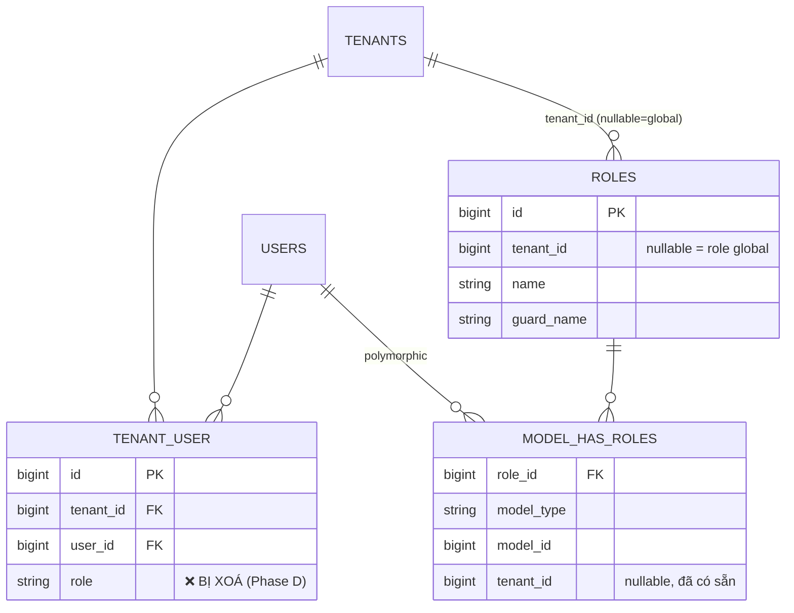

# Plan: Hợp nhất lưu trữ Role của Tenant vào Spatie RBAC

## Bối cảnh

Hiện tại, "user X có role gì trong tenant Y" đang được biểu diễn ở **2 nơi** và **không đồng bộ
với nhau**:

1. **`tenant_user.role`** (cột string đơn giản trên pivot membership, `unique(tenant_id,
   user_id)`).
   Được ghi bởi `AttachUserToTenantUseCase` → `EloquentTenantRepository::attachUser()` và
   `ChangeUserRoleUseCase` → `updateUserRole()`. Được đọc bởi `getUserRole()` (để lấy text
   `old_role`/`new_role` cho notification) và bởi `EloquentUserRepository::findAdminsByTenant()`
   (`WHERE tenant_user.role = 'admin'`).

2. **Spatie `roles` + `model_has_roles`** (scope qua cột `roles.tenant_id` tự thêm trong migration
   `2026_06_05_043900_add_tenant_id_to_permission_tables.php`). Được đọc bởi
   `User::rolesForTenant()` / `hasPermissionInTenant()` / `hasRoleInTenant()` /
   `isAdminOfTenant()` — **đây là thứ mà mọi Policy (`ProjectPolicy`, `TaskPolicy`,
   `TenantPolicy`) thực sự dùng để check quyền.**

### Bug do tình trạng này gây ra

`AttachUserToTenantUseCase` và `ChangeUserRoleUseCase` chỉ ghi vào (1). Không cái nào gọi
`assignRole()`/`removeRole()` của Spatie. Hệ quả:

- Một member mới được attach qua `AttachUserToTenantUseCase` có `tenant_user.role = 'member'`
  nhưng **không có dòng nào trong `model_has_roles`** → `hasPermissionInTenant()` trả về `false`
  cho mọi permission, bất kể role dự định là gì.
- "Đổi role" của user qua `ChangeUserRoleUseCase` chỉ update label trong `tenant_user.role` và gửi
  notification báo role đã đổi, nhưng **bộ quyền thực tế của user không đổi** vì
  `model_has_roles` chưa bao giờ bị động tới.

### Các phát hiện liên quan cần dọn trong cùng lần này

- `app/Domain/User/Enums/RoleDefault.php` — **trùng y nguyên** với `RoleEnum.php`, **không được
  dùng ở đâu cả**. File chết, cần xoá.
- `app/Models/User.php:21` — `private const string RoleSystemAdmin = 'systemAdmin';` (camelCase)
  được `isSystemAdmin()` dùng, nhưng `RoleEnum::SYSTEM_ADMIN->value === 'system_admin'`
  (snake_case, đã được dùng trong `EloquentUserRepository::getSystemAdmin()` vừa fix và trong
  `SetupAppUseCase`). Lệch tên → `isSystemAdmin()` không bao giờ match. Cần sửa thành dùng
  `RoleEnum::SYSTEM_ADMIN->value`.
- `app/Domain/Role/Entities/RoleEntity.php` — hiện đang bị lỗi (`__construct(private readonly )`,
  không có tham số nào). Cần là 1 entity thật để các method repository mới trả về.
- `app/Domain/Role/Repositories/RoleRepositoryInterface.php` và
  `EloquentRoleRepository.php` / `Application/Role/UseCases/GetRolesByTenant.php` — hiện đang là
  stub/rỗng (1 dòng). Plan này sẽ hoàn thiện các file này.
- `config/rolePermissionDefault.php` chỉ định nghĩa `owner` / `admin` / `member` cho mỗi tenant —
  **chưa có bộ permission nào cho `system_admin`**, nên `RoleEnum::SYSTEM_ADMIN` hiện không có
  dòng `roles` tương ứng để `assignRole()` gắn vào. Xử lý ở Phase E.

---

## Mục tiêu

Đưa **Spatie `roles` (scope theo `roles.tenant_id`) + `model_has_roles`** trở thành **nguồn sự
thật duy nhất** cho "role của user X trong tenant Y". `tenant_user` chỉ còn là pivot
**membership** thuần (`tenant_id`, `user_id` — không còn `role`). Mọi việc đọc/ghi "role trong
tenant" đi qua `RoleRepositoryInterface` mới, không đụng trực tiếp cột pivot.

**Invariant cần giữ:** đúng 1 role (scope theo tenant) cho mỗi `(user, tenant)` — khớp với
ràng buộc `unique(tenant_id, user_id)` hiện tại trên `tenant_user`. Repository mới đảm bảo điều
này bằng cách gỡ (remove) các role scope-theo-tenant cũ trước khi gán role mới (Spatie tự nó
không enforce "1 role / tenant").

---

## Thiết kế

### Cấu trúc DB — trước / sau



Sau refactor, "role trong tenant" = dòng `model_has_roles` có `model_id = user.id` VÀ
`model_has_roles.tenant_id = roles.tenant_id = <tenant>` (đây chính là cách `rolesForTenant()`
đang filter — ta chỉ làm cho phần *ghi* đồng bộ với phần *đọc* này).

### Domain layer

**`app/Domain/Role/Entities/RoleEntity.php`** (hiện đang lỗi — cần sửa):

```php
class RoleEntity
{
    public function __construct(
        public readonly int $id,
        public readonly ?int $tenantId,
        public readonly string $name,
        public readonly string $guardName,
    ) {}
}
```

**`app/Domain/Role/Repositories/RoleRepositoryInterface.php`** (mở rộng từ chỗ chỉ có
`create()`):

```php
interface RoleRepositoryInterface
{
    public function findByNameAndTenant(string $name, int $tenantId): ?RoleEntity;

    /** Toàn bộ role khả dụng của 1 tenant (dùng cho dropdown ở UI quản lý team). */
    public function getRolesByTenant(int $tenantId): array;

    /** Role hiện tại của user trong tenant, hoặc null nếu chưa có membership/role. */
    public function getUserRoleForTenant(int $userId, int $tenantId): ?RoleEntity;

    /** Gỡ mọi role scope-theo-tenant hiện có của user, rồi gán $roleName. */
    public function assignUserRole(int $userId, int $tenantId, string $roleName): void;

    /** Danh sách user id trong $tenantId hiện đang có 1 trong các $roleNames. */
    public function findUserIdsByTenantAndRoles(int $tenantId, array $roleNames): array;
}
```

### Application layer

- **`AttachUserToTenantUseCase`**: sau khi gọi
  `tenantRepository->attachUser($tenantId, $userId)` (chỉ còn membership — bỏ tham số `role` khỏi
  lời gọi repo), gọi thêm `roleRepository->assignUserRole($userId, $tenantId, $role)`. Đây chính
  là phần fix bug "member mới không có quyền gì".

- **`ChangeUserRoleUseCase`**:
  - `$oldRole = $roleRepository->getUserRoleForTenant($userId, $tenantId)?->name;`
  - `$roleRepository->assignUserRole($userId, $tenantId, $newRole);`
  - Payload notification giữ nguyên (`old_role`/`new_role` vẫn là string đưa vào
    `TenantRoleChangedHandler`).

- **`SetupAppUseCase`** (Phase E): sau `attchUserTenantWithRole()`, gọi thêm
  `assignUserRole($user->id, $tenant->id, RoleEnum::SYSTEM_ADMIN->value)` để
  `getSystemAdmin()` (đã fix để query `model_has_roles`) tìm được user này.

### Infrastructure layer

- **`EloquentRoleRepository`** — implement interface trên bằng `App\Models\Role` + các method
  `HasRoles` của Spatie trên `App\Models\User`:
  - `assignUserRole()`: lấy/tạo `Role::where('name', $roleName)->where('tenant_id', $tenantId)->where('guard_name','web')->first()`; trên user, gỡ các role hiện có mà `role.tenant_id === $tenantId` (loop `removeRole()` qua `rolesForTenant($tenantId)`), rồi `assignRole($role)` (truyền **instance model**, không phải string name, để tránh nhầm lẫn giữa các role cùng tên ở tenant khác — đúng pattern đã thấy trong `CheckRoleController`).
  - `getUserRoleForTenant()` / `findUserIdsByTenantAndRoles()`: wrapper mỏng quanh
    `User::rolesForTenant()` / `whereHas('roles', fn($q) => $q->where('tenant_id', $tenantId)->whereIn('name', $roleNames))`.

- **`EloquentTenantRepository`**:
  - `attachUser(int $tenantId, int $userId): void` — bỏ tham số `$role`, `attach($userId)` không
    kèm pivot data.
  - Xoá `getUserRole()` / `updateUserRole()` (chuyển sang `RoleRepository`).
  - `TenantRepositoryInterface`: bỏ 2 signature trên.

- **`EloquentUserRepository::findAdminsByTenant()`** — viết lại để query qua roles thay vì pivot:
  ```php
  return User::whereHas('roles', function ($q) use ($tenantId) {
      $q->where('roles.tenant_id', $tenantId)->whereIn('roles.name', ['owner', 'admin']);
  })->pluck('id')->toArray();
  ```
  (`toEntity()` đã lấy `tenants[]['role']` hiển thị từ `rolesForTenant()` rồi — không cần đổi.)

- **`app/Models/User.php`**: sửa `isSystemAdmin()` dùng `RoleEnum::SYSTEM_ADMIN->value` thay cho
  const lệch tên `RoleSystemAdmin = 'systemAdmin'` (xoá const này).

- **Xoá** `app/Domain/User/Enums/RoleDefault.php` (file trùng lặp, chết).

- **Binding**: đăng ký `RoleRepositoryInterface → EloquentRoleRepository` trong
  `AppServiceProvider::boot()`.

### Migration (mới)

1. `xxxx_backfill_model_has_roles_from_tenant_user.php` — **migration dữ liệu**: với mỗi dòng
   `tenant_user`, tìm-hoặc-tạo dòng `roles` tương ứng (`name = tenant_user.role`,
   `tenant_id = tenant_user.tenant_id`, `guard_name = 'web'`) và insert vào `model_has_roles` nếu
   chưa có (idempotent — dùng `firstOrCreate`/`insertOrIgnore`). `down()` là no-op (đây là backfill
   dữ liệu, không reverse được về cấu trúc).
2. `xxxx_drop_role_from_tenant_user_table.php` — `Schema::table('tenant_user', fn($t) =>
   $t->dropColumn('role'))`. `down()` thêm lại `string('role')->nullable()` (dữ liệu không khôi
   phục được khi rollback — chấp nhận được vì Phase C đã backfill nguồn chuẩn).

---

## Các Phase triển khai

**Phase A — Nền tảng Domain & Infrastructure (additive, không đổi behavior)**
- Sửa `RoleEntity` (constructor thật).
- Mở rộng `RoleRepositoryInterface`, implement `EloquentRoleRepository`.
- Bind trong `AppServiceProvider`.
- `tenant_user.role` vẫn còn, vẫn ghi như hiện tại. Toàn bộ test suite phải vẫn xanh.

**Phase B — Fix bug đồng bộ (dual-write)**
- `AttachUserToTenantUseCase` và `ChangeUserRoleUseCase` bắt đầu gọi
  `RoleRepository::assignUserRole()` **bên cạnh** (không thay thế) việc ghi `tenant_user.role`
  hiện tại — giữ `getUserRole()` hoạt động đến Phase D.
- `findAdminsByTenant()` đổi sang query theo Spatie.
- Fix lệch tên `User::isSystemAdmin()`; xoá `RoleDefault.php`.
- **Riêng phase này đã fix được bug thật** (member mới có đúng quyền, đổi role thực sự đổi
  quyền) mà không cần đổi schema.

**Phase C — Migration backfill**
- Chạy migration backfill để các dòng `tenant_user` cũ (tạo trước Phase B) có dòng
  `model_has_roles` tương ứng.
- Query kiểm tra: mọi dòng `tenant_user` đều có đúng 1 dòng `roles` tương ứng qua
  `model_has_roles` với cùng `name`.

**Phase D — Chuyển hẳn phần đọc, drop cột**
- `old_role` trong `ChangeUserRoleUseCase` lấy từ `RoleRepository::getUserRoleForTenant()` thay
  vì `getUserRole()`.
- Xoá `getUserRole()` / `updateUserRole()` khỏi `TenantRepositoryInterface` + implementation.
- `attachUser()` bỏ tham số `$role` (chỉ còn membership).
- Chạy migration drop cột.

**Phase E — Định nghĩa role `system_admin`**
- Quyết định: `system_admin` là role **global** (`roles.tenant_id = NULL`, 1 dòng, gán 1 lần cho
  user bootstrap) hay **per-tenant** giống owner/admin/member?
  *Đề xuất:* global (`tenant_id = NULL`) — vì nó đại diện cho quyền cấp platform, không gắn với
  việc là thành viên của "Alpha Tech Solutions" cụ thể.
  `Role::firstOrCreate(['name' => 'system_admin', 'tenant_id' => null, 'guard_name' => 'web'])`
  với bộ permission quản trị platform được quyết định riêng.
- `SetupAppUseCase::attchUserTenantWithRole()` gọi `assignUserRole()` (hoặc, nếu là global, một
  method riêng `assignGlobalRole()`) để `getSystemAdmin()` tìm được user bootstrap.

---

## Kiểm thử (Verification)

- **Phase A:** `php artisan test` xanh (chỉ thêm code mới). Tinker:
  `app(RoleRepositoryInterface::class)->findByNameAndTenant('owner', 1)` trả về `RoleEntity`.
- **Phase B:** Manual — invite 1 member mới, kiểm tra `model_has_roles` có thêm dòng với
  `tenant_id`/`role_id` đúng VÀ `hasPermissionInTenant()` giờ trả `true` cho các permission của
  role đó. Đổi role 1 user, kiểm tra `hasPermissionInTenant()` phản ánh role mới ngay (đây chính
  là bug fix — nên viết regression test cho case này).
- **Phase C:** Kiểm tra SQL — `SELECT COUNT(*) FROM tenant_user tu LEFT JOIN model_has_roles mhr
  ON mhr.model_id = tu.user_id AND mhr.tenant_id = tu.tenant_id WHERE mhr.role_id IS NULL` phải
  trả về `0`.
- **Phase D:** `php artisan test` xanh; `tenant_user` không còn cột `role`;
  notification của `ChangeUserRoleUseCase` vẫn hiển thị đúng text old/new role.
- **Phase E:** Sau khi chạy setup, `getSystemAdmin()` trả về user bootstrap;
  `$user->hasRole('system_admin')` là `true`.

---

## Critical Files

- `app/Domain/Role/Entities/RoleEntity.php` (sửa)
- `app/Domain/Role/Repositories/RoleRepositoryInterface.php` (mở rộng)
- `app/Infrastructure/Persistence/Repositories/EloquentRoleRepository.php` (implement)
- `app/Application/Tenant/UseCases/AttachUserToTenantUseCase.php`,
  `ChangeUserRoleUseCase.php` (dual-write → cutover)
- `app/Infrastructure/Persistence/Repositories/EloquentTenantRepository.php`,
  `EloquentUserRepository.php`
- `app/Domain/Tenant/Repositories/TenantRepositoryInterface.php`
- `app/Models/User.php` (fix `isSystemAdmin()`), xoá `app/Domain/User/Enums/RoleDefault.php`
- `app/Application/Setup/UseCases/SetupAppUseCase.php`
- `config/rolePermissionDefault.php` (Phase E: thêm entry `system_admin`)
- Migration mới: backfill `model_has_roles`, drop `tenant_user.role`
- `app/Providers/AppServiceProvider.php` (binding mới)
