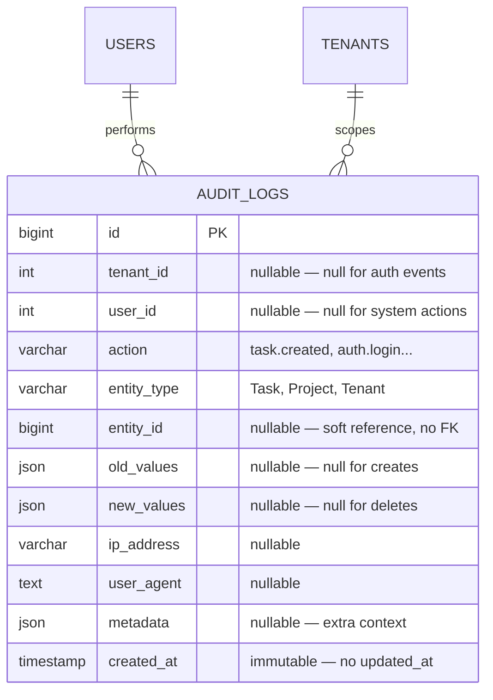
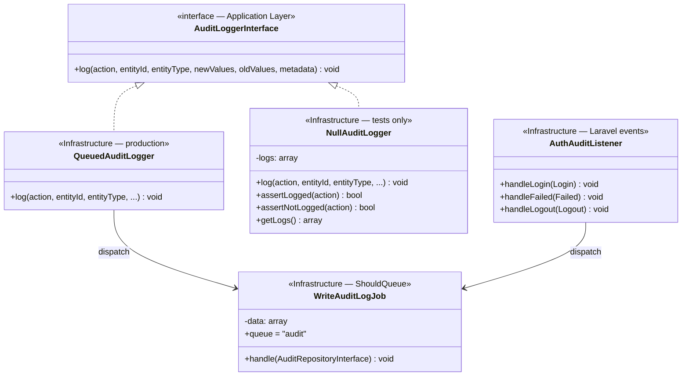
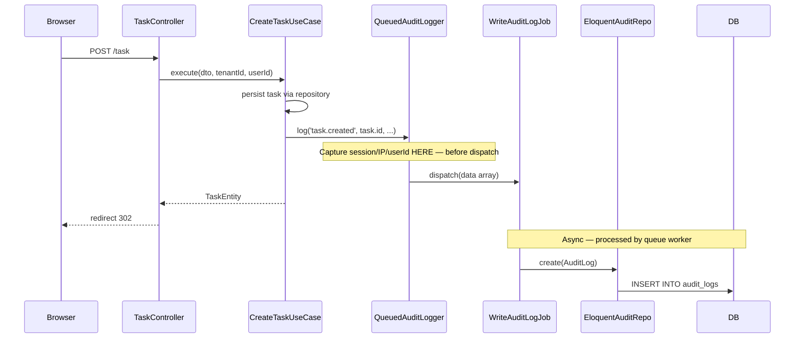
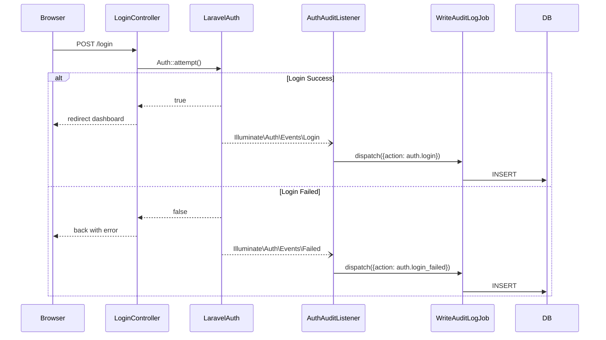
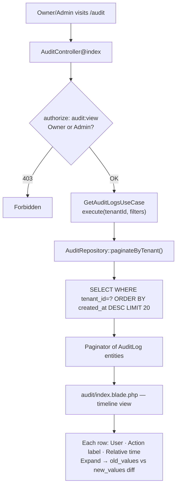

# Audit System — Architecture

**Approach:** D — AuditLogger Service (Hybrid)
**Status:** Approved
**Last Updated:** 2026-06-06

---

## System Overview

```mermaid
graph TB
    subgraph Presentation
        Controller["TaskController / ProjectController / TenantController"]
        AuditController["AuditController (read-only viewer)"]
    end

    subgraph Application
        UseCase["CRUD Use Cases\ninject AuditLoggerInterface"]
        AuditLoggerInterface["AuditLoggerInterface\n+ log(action, entityId, ...)"]
        GetAuditLogsUseCase["GetAuditLogsUseCase"]
    end

    subgraph Domain
        AuditLogEntity["AuditLog Entity"]
        AuditRepoInterface["AuditRepositoryInterface"]
    end

    subgraph Infrastructure
        QueuedAuditLogger["QueuedAuditLogger\nimplements AuditLoggerInterface"]
        AuthAuditListener["AuthAuditListener\n(Laravel Auth Events)"]
        WriteAuditLogJob["WriteAuditLogJob\nqueue: audit"]
        EloquentAuditRepo["EloquentAuditRepository"]
        DB[("audit_logs")]
    end

    Controller -->|invoke| UseCase
    UseCase -->|audit->log()| AuditLoggerInterface
    AuditLoggerInterface -.->|implemented by| QueuedAuditLogger
    QueuedAuditLogger -->|dispatch| WriteAuditLogJob

    AuthAuditListener -->|dispatch| WriteAuditLogJob
    WriteAuditLogJob -->|via| EloquentAuditRepo
    EloquentAuditRepo -.->|implements| AuditRepoInterface
    EloquentAuditRepo -->|INSERT| DB

    AuditController -->|invoke| GetAuditLogsUseCase
    GetAuditLogsUseCase -->|uses| AuditRepoInterface
```

**Key design:** Both paths (CRUD Use Cases + Auth Events) write through the same `WriteAuditLogJob`. LoginController is never modified — `AuthAuditListener` hooks into Laravel's built-in event system.

---

## Data Model



**No FK on `entity_id`:** Tasks and Projects can be deleted; their audit logs must survive. Soft reference only.

---

## Class Design



**`NullAuditLogger`** is used in tests — no queue dispatch, stores logs in memory for assertions.

---

## Flow — Create Task (CRUD path)



**Critical:** `session()`, `auth()->id()`, `request()->ip()` are captured inside `QueuedAuditLogger::log()` — at dispatch time. The Job receives only a plain data array and never accesses session/request.

---

## Flow — Auth Login (Laravel events path)



**LoginController is never modified.** `AuthAuditListener` is registered in `EventServiceProvider` and fires automatically.

---

## Clean Architecture Layer Mapping

```
Domain/Audit/
    Entities/AuditLog.php              — Pure PHP value object, all readonly
    Repositories/AuditRepositoryInterface.php  — create(), paginateByTenant()

Application/Audit/
    AuditLoggerInterface.php           — Interface injected into Use Cases
    UseCases/GetAuditLogsUseCase.php   — Query for viewer

Infrastructure/
    Audit/
        QueuedAuditLogger.php          — implements AuditLoggerInterface, dispatches job
        NullAuditLogger.php            — implements AuditLoggerInterface, for tests
    Listeners/
        AuthAuditListener.php          — handles Laravel Auth events
    Queue/Jobs/
        WriteAuditLogJob.php           — ShouldQueue, queue='audit'
    Persistence/Repositories/
        EloquentAuditRepository.php    — implements AuditRepositoryInterface

Models/
    AuditLog.php                       — Eloquent model, $timestamps=false

Http/Controllers/Admin/
    AuditController.php                — viewer, authorize Owner/Admin only
```

---

## Queue Architecture

```
HTTP Request (synchronous — target < 5ms)
    Use Case → audit->log() → QueuedAuditLogger → Queue::push(WriteAuditLogJob)
    AuthAuditListener                           → Queue::push(WriteAuditLogJob)

Queue Worker (asynchronous)
    WriteAuditLogJob::handle() → EloquentAuditRepository::create() → INSERT audit_logs
```

```bash
# Run queue worker with audit queue prioritized
php artisan queue:work --queue=audit,default
```

Queue `audit` is separate from `default` so audit jobs never block business-critical jobs.

---

## Database Schema & Indexes

```sql
CREATE TABLE audit_logs (
    id          BIGINT UNSIGNED AUTO_INCREMENT PRIMARY KEY,
    tenant_id   INT UNSIGNED NULL,
    user_id     INT UNSIGNED NULL,
    action      VARCHAR(100) NOT NULL,
    entity_type VARCHAR(100) NULL,
    entity_id   BIGINT UNSIGNED NULL,
    old_values  JSON NULL,
    new_values  JSON NULL,
    ip_address  VARCHAR(45) NULL,
    user_agent  TEXT NULL,
    metadata    JSON NULL,
    created_at  TIMESTAMP DEFAULT CURRENT_TIMESTAMP
    -- No updated_at — immutable record
);

CREATE INDEX idx_tenant_created ON audit_logs (tenant_id, created_at DESC);  -- viewer default query
CREATE INDEX idx_tenant_user    ON audit_logs (tenant_id, user_id);           -- filter by user
CREATE INDEX idx_tenant_action  ON audit_logs (tenant_id, action);            -- filter by action
CREATE INDEX idx_entity         ON audit_logs (entity_type, entity_id);       -- entity lookup
```

---

## Retention Policy

```
Scheduled Command: AuditCleanupCommand (daily)
    DELETE FROM audit_logs
    WHERE created_at < NOW() - INTERVAL $retentionDays DAY
    LIMIT 1000 per batch    ← avoid table lock
```

```env
AUDIT_RETENTION_DAYS=90
AUDIT_ENABLED=true
```

The scheduled command never exposes a user-facing endpoint. Retention only via Artisan schedule.

---

## Audit Viewer UI Flow


