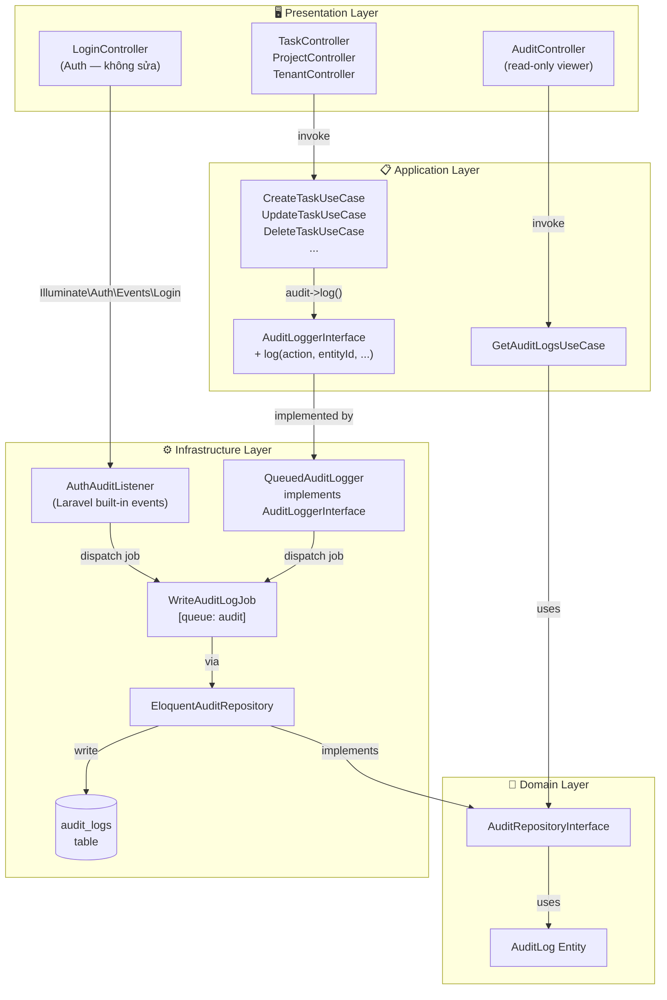
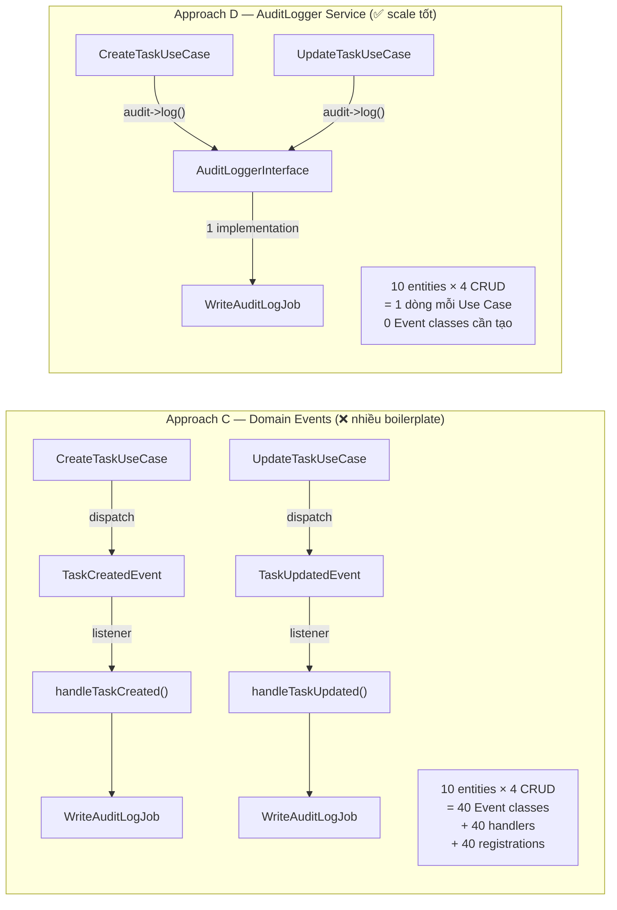
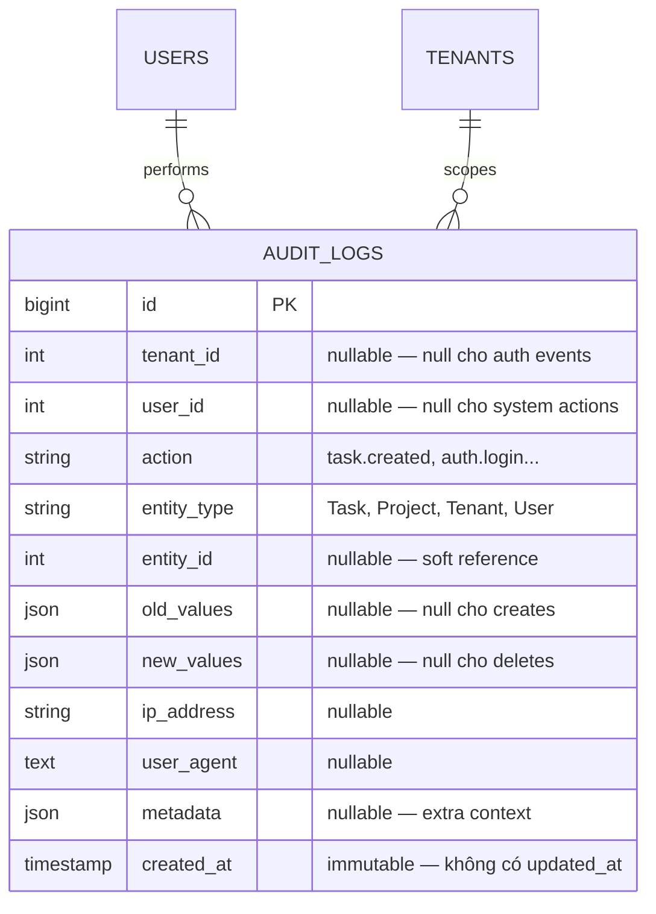
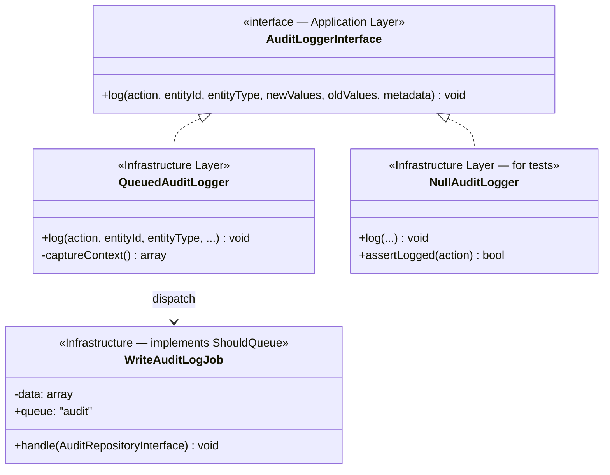
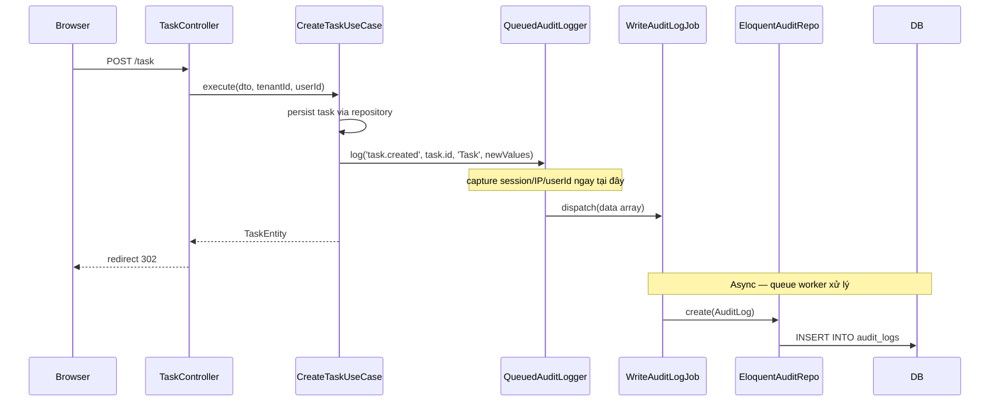
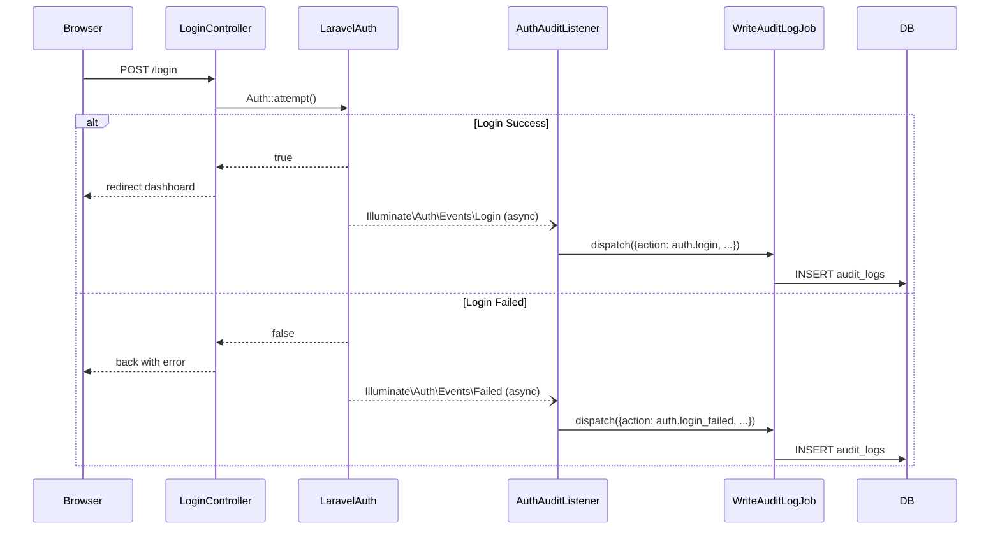
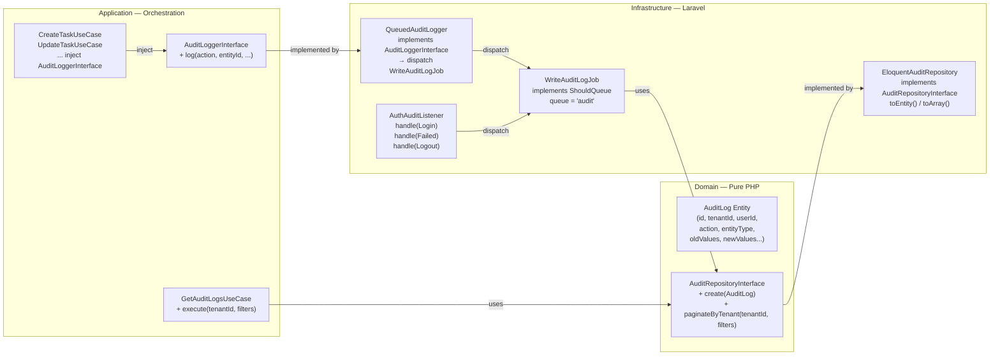
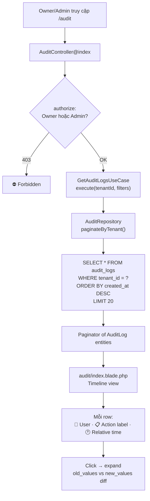
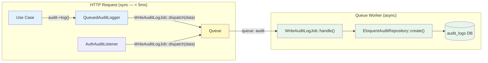
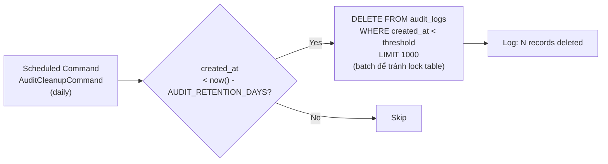

# Audit System — Architecture

---
Version: 1.1
Last Updated: 2026-06-06
Status: Approved
Author: Architecture Team
Approach: D — AuditLogger Service (Hybrid)
---

## System Overview



**Caption:** AuditLogger được inject vào Use Cases. Auth events dùng Laravel built-in — không cần sửa LoginController. Cả hai đều ghi qua cùng 1 Queue Job.

---

## So Sánh Với Approach C (Domain Events)



---

## Data Model



**Không dùng FK constraints:** Entity (Task, Project) có thể bị xoá nhưng audit log phải tồn tại mãi. FK gây lỗi khi xoá entity.

---

## AuditLogger — Class Design



**`NullAuditLogger`** dùng trong tests — không dispatch queue, chỉ giữ log trong memory để assert.

---

## Event Flow — Create Task (Approach D)



**Caption:** Context (session, IP, user) được capture tại `QueuedAuditLogger::log()` — trước khi dispatch job. Job chỉ nhận plain array data, không truy cập session.

---

## Event Flow — Auth Login (Laravel Built-in)



**Caption:** Auth events dùng Laravel's built-in event system — không cần sửa LoginController. `AuthAuditListener` là listener duy nhất cho auth events.

---

## Clean Architecture Layer Mapping



---

## Audit Log Viewer — UI Flow



---

## Queue Architecture



```
QUEUE_CONNECTION=database
php artisan queue:work --queue=audit,default
```

Queue `audit` tách riêng để audit jobs không block business jobs.

---

## Database Schema & Indexes

```sql
CREATE TABLE audit_logs (
    id          BIGINT UNSIGNED AUTO_INCREMENT PRIMARY KEY,
    tenant_id   INT UNSIGNED NULL,
    user_id     INT UNSIGNED NULL,
    action      VARCHAR(100) NOT NULL,
    entity_type VARCHAR(100) NULL,
    entity_id   BIGINT UNSIGNED NULL,
    old_values  JSON NULL,
    new_values  JSON NULL,
    ip_address  VARCHAR(45) NULL,
    user_agent  TEXT NULL,
    metadata    JSON NULL,
    created_at  TIMESTAMP DEFAULT CURRENT_TIMESTAMP
    -- Không có updated_at — immutable
);

-- Indexes cho viewer queries
CREATE INDEX idx_tenant_created ON audit_logs (tenant_id, created_at DESC);
CREATE INDEX idx_tenant_user    ON audit_logs (tenant_id, user_id);
CREATE INDEX idx_tenant_action  ON audit_logs (tenant_id, action);
CREATE INDEX idx_entity         ON audit_logs (entity_type, entity_id);
```

---

## Retention Policy



```env
AUDIT_RETENTION_DAYS=90   # default 90 ngày
AUDIT_ENABLED=true        # tắt khi local dev / tests
```

---

## File Structure

```
app/
├── Domain/
│   └── Audit/
│       ├── Entities/
│       │   └── AuditLog.php
│       └── Repositories/
│           └── AuditRepositoryInterface.php
│
├── Application/
│   └── Audit/
│       ├── AuditLoggerInterface.php          ← interface cho Use Cases inject
│       └── UseCases/
│           └── GetAuditLogsUseCase.php
│
├── Infrastructure/
│   ├── Audit/
│   │   ├── QueuedAuditLogger.php             ← implements AuditLoggerInterface
│   │   └── NullAuditLogger.php               ← dùng trong tests
│   ├── Persistence/Repositories/
│   │   └── EloquentAuditRepository.php
│   └── Queue/Jobs/
│       └── WriteAuditLogJob.php
│
├── Models/
│   └── AuditLog.php
│
└── Http/
    ├── Controllers/Admin/
    │   └── AuditController.php
    └── Listeners/
        └── AuthAuditListener.php             ← chỉ cho auth events

database/
└── migrations/
    └── 2026_06_06_000000_create_audit_logs_table.php

resources/views/admin/pages/audit/
└── index.blade.php
```

---

## Related Documents

- [01-REQUIREMENTS.md](./01-REQUIREMENTS.md) — Functional requirements
- [03-APPROACHES.md](./03-APPROACHES.md) — Tại sao chọn Approach D
- [04-IMPLEMENTATION_PLAN.md](./04-IMPLEMENTATION_PLAN.md) — Build steps
