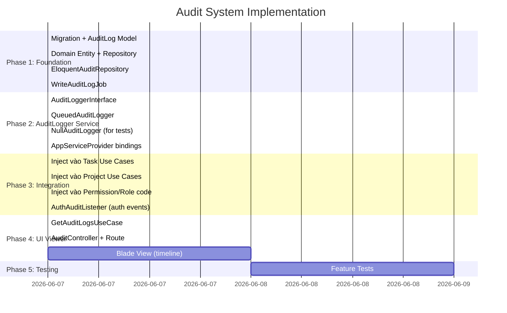

# Audit System — Implementation Plan

---
Version: 1.1
Last Updated: 2026-06-06
Status: Approved
Author: Architecture Team
Approach: D — AuditLogger Service + Laravel Auth Events (Hybrid)
---

## Phase Overview



---

## Phase 1: Foundation

### 1.1 Migration

**File:** `database/migrations/2026_06_06_000000_create_audit_logs_table.php`

```php
Schema::create('audit_logs', function (Blueprint $table) {
    $table->id();
    $table->unsignedBigInteger('tenant_id')->nullable();
    $table->unsignedBigInteger('user_id')->nullable();
    $table->string('action', 100);
    $table->string('entity_type', 100)->nullable();
    $table->unsignedBigInteger('entity_id')->nullable();
    $table->json('old_values')->nullable();
    $table->json('new_values')->nullable();
    $table->string('ip_address', 45)->nullable();
    $table->text('user_agent')->nullable();
    $table->json('metadata')->nullable();
    $table->timestamp('created_at')->useCurrent();
    // Không có updated_at — audit log là immutable

    $table->index(['tenant_id', 'created_at']);
    $table->index(['tenant_id', 'user_id']);
    $table->index(['tenant_id', 'action']);
    $table->index(['entity_type', 'entity_id']);
});
```

### 1.2 Domain Entity

**File:** `app/Domain/Audit/Entities/AuditLog.php`

```php
namespace App\Domain\Audit\Entities;

class AuditLog
{
    public function __construct(
        public readonly ?int    $id,
        public readonly ?int    $tenantId,
        public readonly ?int    $userId,
        public readonly string  $action,
        public readonly ?string $entityType,
        public readonly ?int    $entityId,
        public readonly ?array  $oldValues,
        public readonly ?array  $newValues,
        public readonly ?string $ipAddress,
        public readonly ?string $userAgent,
        public readonly ?array  $metadata,
        public readonly ?string $createdAt,
    ) {}
}
```

### 1.3 Repository Interface

**File:** `app/Domain/Audit/Repositories/AuditRepositoryInterface.php`

```php
namespace App\Domain\Audit\Repositories;

use App\Domain\Audit\Entities\AuditLog;
use Illuminate\Contracts\Pagination\LengthAwarePaginator;

interface AuditRepositoryInterface
{
    public function create(AuditLog $auditLog): void;
    public function paginateByTenant(int $tenantId, array $filters = [], int $perPage = 20): LengthAwarePaginator;
}
```

### 1.4 Eloquent Model

**File:** `app/Models/AuditLog.php`

```php
namespace App\Models;

use Illuminate\Database\Eloquent\Model;

class AuditLog extends Model
{
    public $timestamps = false;
    protected $guarded = ['id'];

    protected function casts(): array
    {
        return [
            'old_values' => 'array',
            'new_values' => 'array',
            'metadata'   => 'array',
            'created_at' => 'datetime',
        ];
    }
}
```

### 1.5 Eloquent Repository

**File:** `app/Infrastructure/Persistence/Repositories/EloquentAuditRepository.php`

```php
class EloquentAuditRepository implements AuditRepositoryInterface
{
    public function create(AuditLog $entity): void
    {
        \App\Models\AuditLog::create($this->toArray($entity));
    }

    public function paginateByTenant(int $tenantId, array $filters = [], int $perPage = 20): LengthAwarePaginator
    {
        return \App\Models\AuditLog::query()
            ->where('tenant_id', $tenantId)
            ->when($filters['user_id'] ?? null, fn($q, $v) => $q->where('user_id', $v))
            ->when($filters['action']  ?? null, fn($q, $v) => $q->where('action', $v))
            ->when($filters['from']    ?? null, fn($q, $v) => $q->whereDate('created_at', '>=', $v))
            ->when($filters['to']      ?? null, fn($q, $v) => $q->whereDate('created_at', '<=', $v))
            ->orderByDesc('created_at')
            ->paginate($perPage);
    }

    private function toArray(AuditLog $entity): array
    {
        return [
            'tenant_id'   => $entity->tenantId,
            'user_id'     => $entity->userId,
            'action'      => $entity->action,
            'entity_type' => $entity->entityType,
            'entity_id'   => $entity->entityId,
            'old_values'  => $entity->oldValues,
            'new_values'  => $entity->newValues,
            'ip_address'  => $entity->ipAddress,
            'user_agent'  => $entity->userAgent,
            'metadata'    => $entity->metadata,
        ];
    }

    private function toEntity(\App\Models\AuditLog $model): AuditLog
    {
        return new AuditLog(
            id:         $model->id,
            tenantId:   $model->tenant_id,
            userId:     $model->user_id,
            action:     $model->action,
            entityType: $model->entity_type,
            entityId:   $model->entity_id,
            oldValues:  $model->old_values,
            newValues:  $model->new_values,
            ipAddress:  $model->ip_address,
            userAgent:  $model->user_agent,
            metadata:   $model->metadata,
            createdAt:  $model->created_at?->toDateTimeString(),
        );
    }
}
```

### 1.6 WriteAuditLogJob

**File:** `app/Infrastructure/Queue/Jobs/WriteAuditLogJob.php`

```php
class WriteAuditLogJob implements ShouldQueue
{
    use Dispatchable, InteractsWithQueue, Queueable;

    public string $queue = 'audit';

    public function __construct(private readonly array $data) {}

    public function handle(AuditRepositoryInterface $repo): void
    {
        $repo->create(new AuditLog(
            id:         null,
            tenantId:   $this->data['tenant_id'],
            userId:     $this->data['user_id'],
            action:     $this->data['action'],
            entityType: $this->data['entity_type'] ?? null,
            entityId:   $this->data['entity_id'] ?? null,
            oldValues:  $this->data['old_values'] ?? null,
            newValues:  $this->data['new_values'] ?? null,
            ipAddress:  $this->data['ip_address'] ?? null,
            userAgent:  $this->data['user_agent'] ?? null,
            metadata:   $this->data['metadata'] ?? null,
            createdAt:  null,
        ));
    }
}
```

---

## Phase 2: AuditLogger Service

### 2.1 Interface

**File:** `app/Application/Audit/AuditLoggerInterface.php`

```php
namespace App\Application\Audit;

interface AuditLoggerInterface
{
    public function log(
        string  $action,
        ?int    $entityId    = null,
        ?string $entityType  = null,
        ?array  $newValues   = null,
        ?array  $oldValues   = null,
        ?array  $metadata    = null,
    ): void;
}
```

### 2.2 QueuedAuditLogger (Production)

**File:** `app/Infrastructure/Audit/QueuedAuditLogger.php`

```php
namespace App\Infrastructure\Audit;

use App\Application\Audit\AuditLoggerInterface;
use App\Infrastructure\Queue\Jobs\WriteAuditLogJob;

class QueuedAuditLogger implements AuditLoggerInterface
{
    public function log(
        string  $action,
        ?int    $entityId   = null,
        ?string $entityType = null,
        ?array  $newValues  = null,
        ?array  $oldValues  = null,
        ?array  $metadata   = null,
    ): void {
        if (! config('audit.enabled', true)) {
            return;
        }

        // Capture context ngay tại đây — trước khi dispatch
        // Job chỉ nhận data array, không truy cập session/request
        WriteAuditLogJob::dispatch([
            'tenant_id'   => session('current_tenant_id'),
            'user_id'     => auth()->id(),
            'action'      => $action,
            'entity_type' => $entityType,
            'entity_id'   => $entityId,
            'old_values'  => $oldValues,
            'new_values'  => $newValues,
            'ip_address'  => request()->ip(),
            'user_agent'  => request()->userAgent(),
            'metadata'    => $metadata,
        ]);
    }
}
```

### 2.3 NullAuditLogger (Tests)

**File:** `app/Infrastructure/Audit/NullAuditLogger.php`

```php
namespace App\Infrastructure\Audit;

use App\Application\Audit\AuditLoggerInterface;

class NullAuditLogger implements AuditLoggerInterface
{
    private array $logs = [];

    public function log(string $action, ?int $entityId = null, ...): void
    {
        $this->logs[] = ['action' => $action, 'entity_id' => $entityId];
    }

    public function assertLogged(string $action): bool
    {
        return collect($this->logs)->contains('action', $action);
    }

    public function assertNotLogged(string $action): bool
    {
        return ! $this->assertLogged($action);
    }

    public function getLogs(): array
    {
        return $this->logs;
    }
}
```

### 2.4 Bindings trong AppServiceProvider

```php
// Bindings audit
$this->app->bind(
    \App\Application\Audit\AuditLoggerInterface::class,
    \App\Infrastructure\Audit\QueuedAuditLogger::class,
);

$this->app->bind(
    \App\Domain\Audit\Repositories\AuditRepositoryInterface::class,
    \App\Infrastructure\Persistence\Repositories\EloquentAuditRepository::class,
);
```

---

## Phase 3: Integration vào Use Cases

### 3.1 Pattern chung cho CRUD Use Cases

**Inject `AuditLoggerInterface` + gọi `$this->audit->log()` sau operation thành công:**

```php
// CreateTaskUseCase.php
class CreateTaskUseCase
{
    public function __construct(
        private TaskRepositoryInterface $repo,
        private AuditLoggerInterface    $audit,
    ) {}

    public function execute(CreateTaskDTO $dto, int $tenantId, int $createdBy): TaskEntity
    {
        $task = $this->repo->create($dto, $tenantId, $createdBy);

        $this->audit->log(
            action:     'task.created',
            entityId:   $task->id,
            entityType: 'Task',
            newValues:  [
                'title'      => $task->title,
                'status'     => $task->status,
                'priority'   => $task->priority,
                'project_id' => $task->projectId,
            ],
        );

        return $task;
    }
}
```

```php
// UpdateTaskUseCase.php — capture oldValues TRƯỚC khi update
public function execute(int $id, int $tenantId, UpdateTaskDTO $dto): TaskEntity
{
    $existing = $this->repo->findById($id, $tenantId);

    // Capture trước khi update
    $oldValues = [
        'title'    => $existing->title,
        'status'   => $existing->status,
        'priority' => $existing->priority,
    ];

    $updated = $this->repo->update($id, $tenantId, $dto);

    $this->audit->log(
        action:     'task.updated',
        entityId:   $updated->id,
        entityType: 'Task',
        oldValues:  $oldValues,
        newValues:  [
            'title'    => $updated->title,
            'status'   => $updated->status,
            'priority' => $updated->priority,
        ],
    );

    return $updated;
}
```

```php
// DeleteTaskUseCase.php — snapshot trước khi xoá
public function execute(int $id, int $tenantId): void
{
    $task = $this->repo->findById($id, $tenantId);

    $snapshot = ['title' => $task->title, 'status' => $task->status];

    $this->repo->delete($id, $tenantId);

    $this->audit->log(
        action:     'task.deleted',
        entityId:   $id,
        entityType: 'Task',
        oldValues:  $snapshot,
    );
}
```

### 3.2 Use Cases cần update

| Use Case | Action | old_values | new_values |
|---|---|---|---|
| `CreateTaskUseCase` | `task.created` | null | title, status, priority |
| `UpdateTaskUseCase` | `task.updated` | title, status, priority | title, status, priority |
| `DeleteTaskUseCase` | `task.deleted` | title, status | null |
| `CreateProjectUseCase` | `project.created` | null | name, description |
| `UpdateProjectUseCase` | `project.updated` | name | name |
| `DeleteProjectUseCase` | `project.deleted` | name | null |

### 3.3 AuthAuditListener (Auth events — Laravel built-in)

**File:** `app/Http/Listeners/AuthAuditListener.php`

```php
class AuthAuditListener
{
    public function handleLogin(Login $event): void
    {
        WriteAuditLogJob::dispatch([
            'tenant_id'   => null,
            'user_id'     => $event->user->id,
            'action'      => 'auth.login',
            'entity_type' => 'User',
            'entity_id'   => $event->user->id,
            'ip_address'  => request()->ip(),
            'user_agent'  => request()->userAgent(),
        ]);
    }

    public function handleFailed(Failed $event): void
    {
        WriteAuditLogJob::dispatch([
            'tenant_id'  => null,
            'user_id'    => null,
            'action'     => 'auth.login_failed',
            'ip_address' => request()->ip(),
            'metadata'   => ['email' => $event->credentials['email'] ?? null],
        ]);
    }

    public function handleLogout(Logout $event): void
    {
        WriteAuditLogJob::dispatch([
            'tenant_id' => null,
            'user_id'   => $event->user?->id,
            'action'    => 'auth.logout',
            'ip_address'=> request()->ip(),
        ]);
    }
}
```

**Register trong `EventServiceProvider`:**

```php
protected $listen = [
    \Illuminate\Auth\Events\Login::class   => [AuthAuditListener::class . '@handleLogin'],
    \Illuminate\Auth\Events\Failed::class  => [AuthAuditListener::class . '@handleFailed'],
    \Illuminate\Auth\Events\Logout::class  => [AuthAuditListener::class . '@handleLogout'],
];
```

---

## Phase 4: UI Viewer

### 4.1 GetAuditLogsUseCase

**File:** `app/Application/Audit/UseCases/GetAuditLogsUseCase.php`

```php
class GetAuditLogsUseCase
{
    public function __construct(
        private readonly AuditRepositoryInterface $repo
    ) {}

    public function execute(int $tenantId, array $filters = []): LengthAwarePaginator
    {
        return $this->repo->paginateByTenant($tenantId, $filters);
    }
}
```

### 4.2 AuditController

**File:** `app/Http/Controllers/Admin/AuditController.php`

```php
class AuditController extends Controller
{
    public function __construct(
        private readonly GetAuditLogsUseCase $getAuditLogsUseCase
    ) {}

    public function index(Request $request)
    {
        try {
            $tenantId = session('current_tenant_id');
            $this->authorize('viewAuditLog', Tenant::find($tenantId));

            $filters = $request->only(['user_id', 'action', 'from', 'to']);
            $logs    = $this->getAuditLogsUseCase->execute($tenantId, $filters);

            return view('admin.pages.audit.index', compact('logs'));
        } catch (AuthorizationException | HttpException $e) {
            throw $e;
        } catch (\Exception $e) {
            Log::error($e->getMessage());
            return back()->with('error', 'Failed to load audit logs.');
        }
    }
}
```

### 4.3 Route

```php
Route::get('/audit', [AuditController::class, 'index'])->name('audit.index');
```

### 4.4 TenantPolicy — thêm method

```php
// app/Policies/TenantPolicy.php
public function viewAuditLog(User $user, Tenant $tenant): bool
{
    return $user->hasPermissionInTenant('audit:view', $tenant->id);
}
```

---

## Phase 5: Testing

### Test Pattern — Mock AuditLogger

```php
class CreateTaskAuditTest extends TestCase
{
    #[Test]
    public function creating_task_logs_audit_event(): void
    {
        $nullLogger = new NullAuditLogger();
        $this->app->instance(AuditLoggerInterface::class, $nullLogger);

        $this->actingAs($this->owner)
            ->withSession(['current_tenant_id' => $this->tenant->id])
            ->post(route('task.store'), $this->validTaskData);

        $this->assertTrue($nullLogger->assertLogged('task.created'));
    }

    #[Test]
    public function updating_task_records_old_and_new_values(): void
    {
        $nullLogger = new NullAuditLogger();
        $this->app->instance(AuditLoggerInterface::class, $nullLogger);

        $this->actingAs($this->owner)
            ->withSession(['current_tenant_id' => $this->tenant->id])
            ->put(route('task.update', $this->task->id), ['title' => 'New Title', ...]);

        $log = collect($nullLogger->getLogs())->firstWhere('action', 'task.updated');
        $this->assertNotNull($log['old_values']);
        $this->assertNotNull($log['new_values']);
    }
}
```

### Test Cases cần cover

```
✓ creating task → logs task.created với new_values đúng
✓ updating task → logs task.updated với old_values và new_values đúng
✓ deleting task → logs task.deleted với snapshot của task cũ
✓ creating project → logs project.created
✓ login thành công → logs auth.login
✓ login thất bại → logs auth.login_failed với email trong metadata
✓ logout → logs auth.logout
✓ audit viewer accessible by owner
✓ audit viewer accessible by admin
✓ audit viewer NOT accessible by member
✓ audit viewer NOT accessible by guest
✓ cross-tenant: không thể xem logs của tenant khác
✓ audit log không bị xoá khi entity bị delete
```

---

## Checklist Tổng

### Phase 1 — Foundation
- [ ] Migration `create_audit_logs_table` + `php artisan migrate`
- [ ] `app/Domain/Audit/Entities/AuditLog.php`
- [ ] `app/Domain/Audit/Repositories/AuditRepositoryInterface.php`
- [ ] `app/Models/AuditLog.php`
- [ ] `app/Infrastructure/Persistence/Repositories/EloquentAuditRepository.php`
- [ ] `app/Infrastructure/Queue/Jobs/WriteAuditLogJob.php`

### Phase 2 — AuditLogger Service
- [ ] `app/Application/Audit/AuditLoggerInterface.php`
- [ ] `app/Infrastructure/Audit/QueuedAuditLogger.php`
- [ ] `app/Infrastructure/Audit/NullAuditLogger.php`
- [ ] Bindings trong `AppServiceProvider`
- [ ] `config/audit.php` (`enabled`, `retention_days`)

### Phase 3 — Integration
- [ ] Inject `AuditLoggerInterface` vào `CreateTaskUseCase` + `audit->log()`
- [ ] Inject vào `UpdateTaskUseCase` + capture `oldValues` trước update
- [ ] Inject vào `DeleteTaskUseCase` + capture snapshot trước delete
- [ ] Inject vào `CreateProjectUseCase`, `UpdateProjectUseCase`, `DeleteProjectUseCase`
- [ ] `app/Http/Listeners/AuthAuditListener.php`
- [ ] Register listeners trong `EventServiceProvider`

### Phase 4 — UI Viewer
- [ ] `app/Application/Audit/UseCases/GetAuditLogsUseCase.php`
- [ ] `app/Http/Controllers/Admin/AuditController.php`
- [ ] `TenantPolicy::viewAuditLog()` method
- [ ] Route `/audit` trong `routes/web.php`
- [ ] `resources/views/admin/pages/audit/index.blade.php`
- [ ] Sidebar link (cho Owner và Admin)

### Phase 5 — Testing
- [ ] `tests/Feature/AuditLogTest.php` — 13+ test cases
- [ ] Verify `NullAuditLogger` hoạt động đúng trong test context
- [ ] Test cross-tenant isolation

---

## Related Documents

- [00-OVERVIEW.md](./00-OVERVIEW.md) — Problem statement, business value
- [01-REQUIREMENTS.md](./01-REQUIREMENTS.md) — Functional requirements
- [02-ARCHITECTURE.md](./02-ARCHITECTURE.md) — Diagrams và file structure
- [03-APPROACHES.md](./03-APPROACHES.md) — Tại sao chọn Approach D
