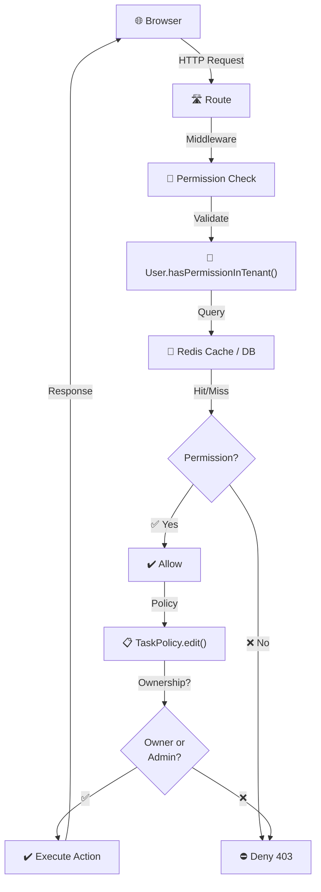
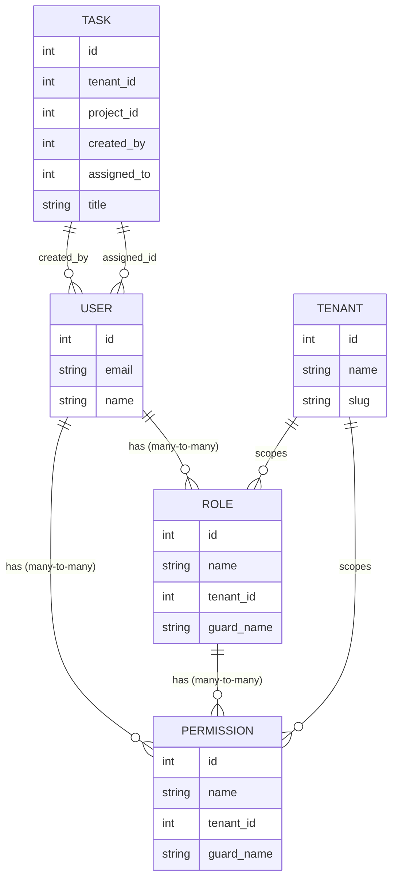
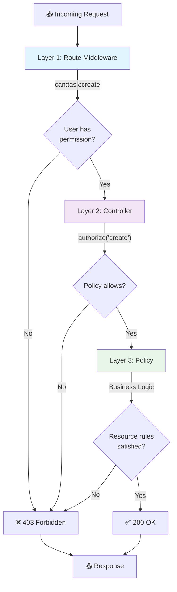
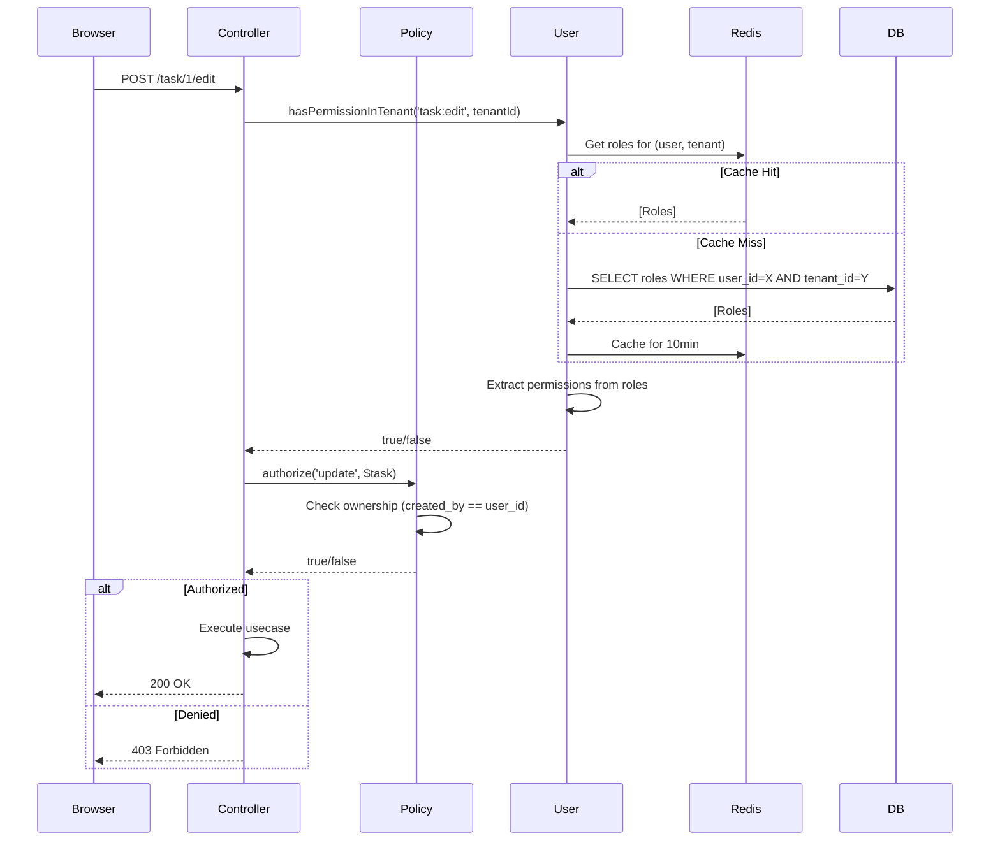
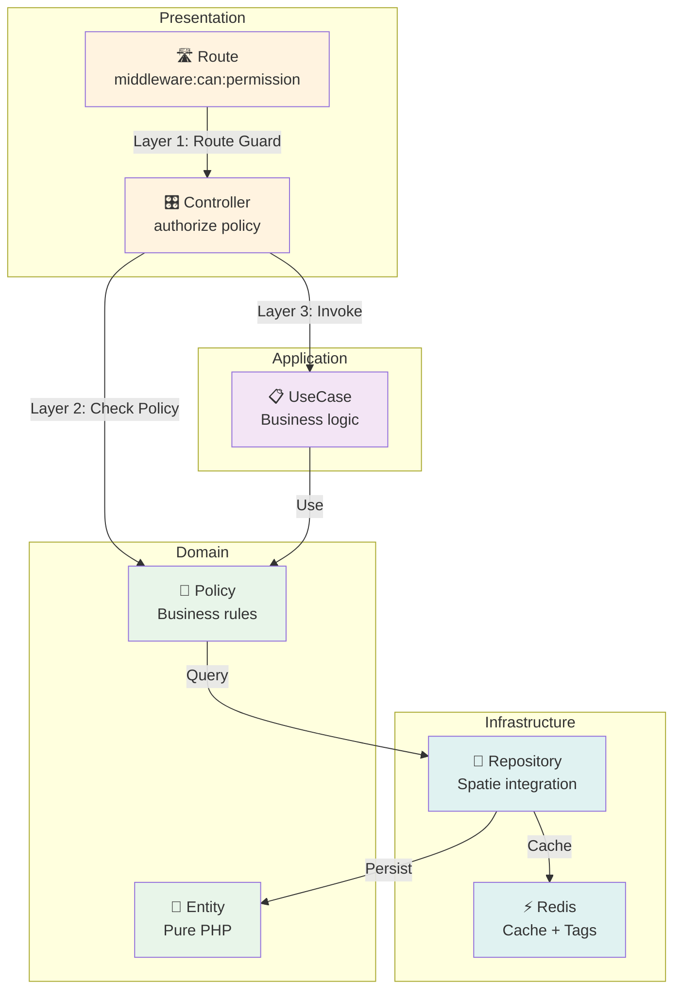
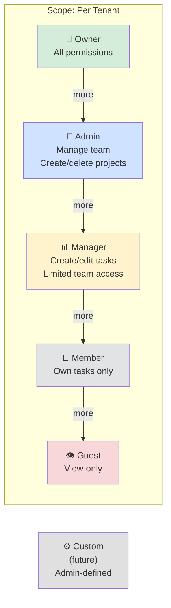
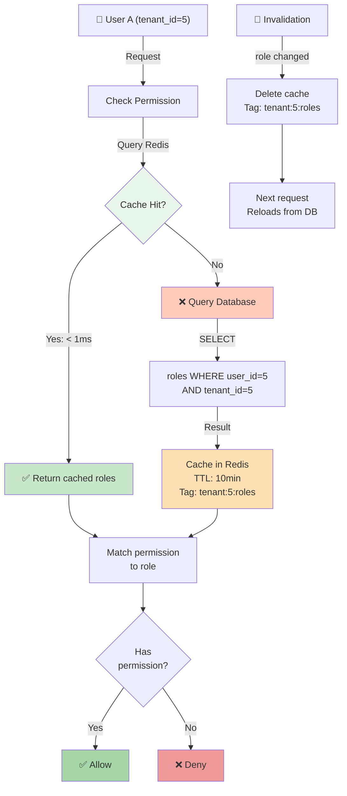
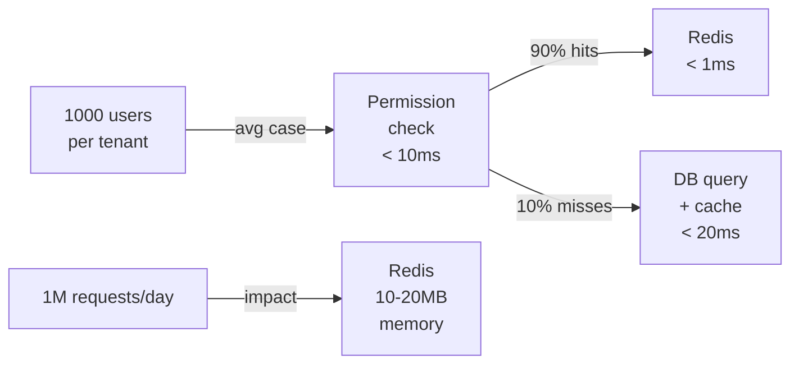

# Permission & RBAC — Architecture

---
Version: 1.0
Last Updated: 2026-06-04
Status: Approved
Author: Architecture Team
---

## System Overview



**Caption:** Request flow with permission checking at 3 layers (Middleware → Controller → Policy)

---

## Data Model



**Caption:** Role-based access control data model with tenant scoping

---

## Authorization Layers



**Caption:** Three-layer authorization architecture (defense in depth)

---

## Permission Check Sequence



**Caption:** Complete flow of permission checking with caching strategy

---

## Clean Architecture Integration



**Caption:** Permission system integrated with clean architecture layers

---

## Role Hierarchy (Not Linear — Approach B)



**Caption:** Role hierarchy — each role has permissions of lower roles (approximately)

---

## Permission Caching Strategy



**Caption:** Caching with tag-based invalidation ensures performance + freshness

---

## File Structure

```
app/
├── Models/
│   ├── Role.php (extend Spatie, add scopeForTenant())
│   ├── Permission.php (extend Spatie, add scopeForTenant())
│   └── User.php (add rolesForTenant(), hasPermissionInTenant())
│
├── Policies/
│   ├── TaskPolicy.php (view, create, update, delete, assign)
│   ├── ProjectPolicy.php (view, create, update, delete)
│   └── TenantPolicy.php (view, edit, delete, inviteUser, removeUser)
│
├── Http/
│   ├── Controllers/Admin/TaskController.php
│   │   (updated with authorize() calls)
│   └── Middleware/
│       └── TenantScopedPermission.php (set tenant context)
│
└── Providers/
    └── AuthServiceProvider.php (register policies)

database/
├── migrations/
│   └── 2026_06_04_000000_add_tenant_id_to_permission_tables.php
│
└── seeders/
    └── RolePermissionSeeder.php (6 roles × 25 permissions)

resources/views/admin/pages/
├── task/
│   ├── index.blade.php (@can directives)
│   └── create.blade.php (@can on buttons)
```

---

## Technology Choices

| Component | Choice | Why |
|---|---|---|
| **Permission Library** | spatie/laravel-permission | Industry standard, active, works with Laravel Policies |
| **Tenant Scoping** | Explicit tenant_id in models | Safety > convenience, prevents leaks |
| **Caching** | Redis with tags | Fast < 1ms, tag-based invalidation safe for multi-tenant |
| **Authorization** | Laravel Policies | Matches Laravel conventions, integrates with authorize() |
| **API Auth** | Token-based (future) | Can extend Permission to API guards |

---

## Design Patterns Used

1. **Policy Pattern** — Each resource has a Policy that answers "can user X do action Y?"
2. **Tag-based Cache Invalidation** — Invalidate all cache for a tenant atomically
3. **Multi-layer Defense** — Route → Controller → Policy (defense in depth)
4. **Explicit over Implicit** — tenant_id always visible, no magic scoping

---

## Performance Assumptions



**Caption:** Performance profile and resource usage estimates

---

## Security Model

```
Threat: User A accesses Task belonging to Tenant B
    ↓
Defense 1: Route middleware requires tenant_id in request
    ↓
Defense 2: Controller validates user has permission in tenant_id
    ↓
Defense 3: Policy checks resource ownership
    ↓
Defense 4: Query scoped by tenant_id
    ↓
Result: ✅ Prevented — data isolation maintained
```

---

## Related Documents

- [01-REQUIREMENTS.md](./01-REQUIREMENTS.md) — What we're building
- [03-APPROACHES.md](./03-APPROACHES.md) — Why Approach B over A/C
- [04-IMPLEMENTATION_PLAN_B.md](./04-IMPLEMENTATION_PLAN_B.md) — How to build it

