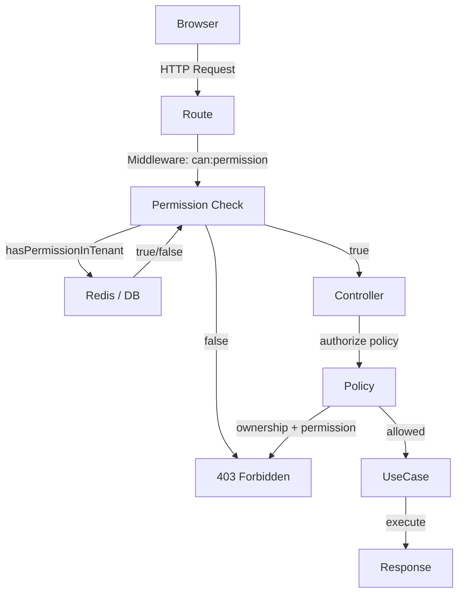
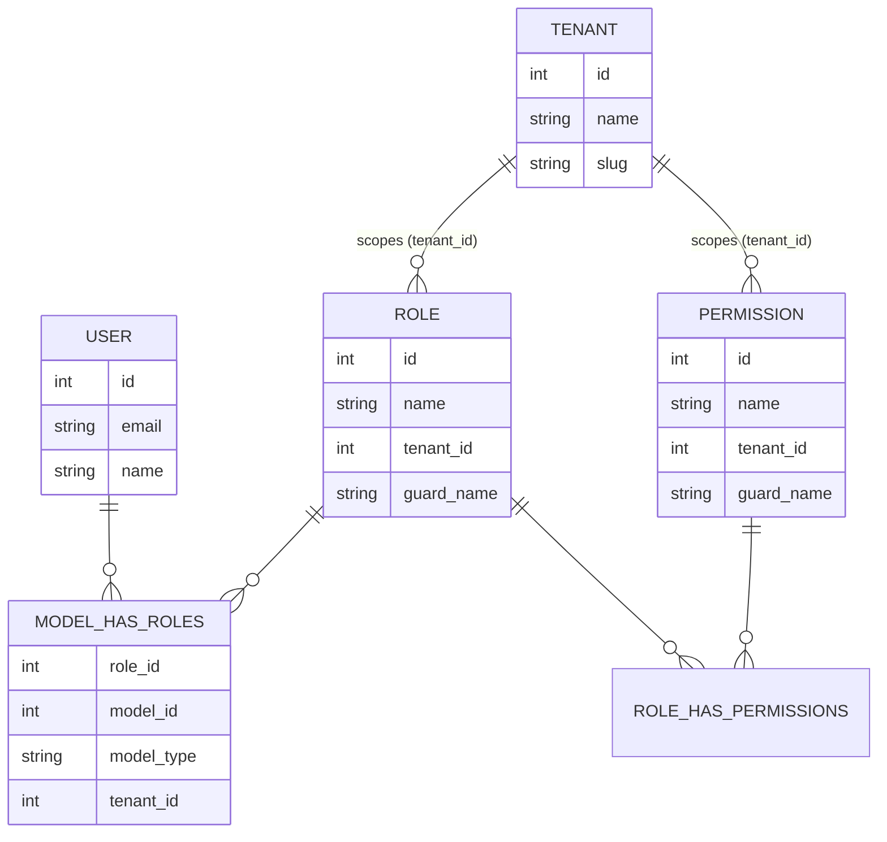
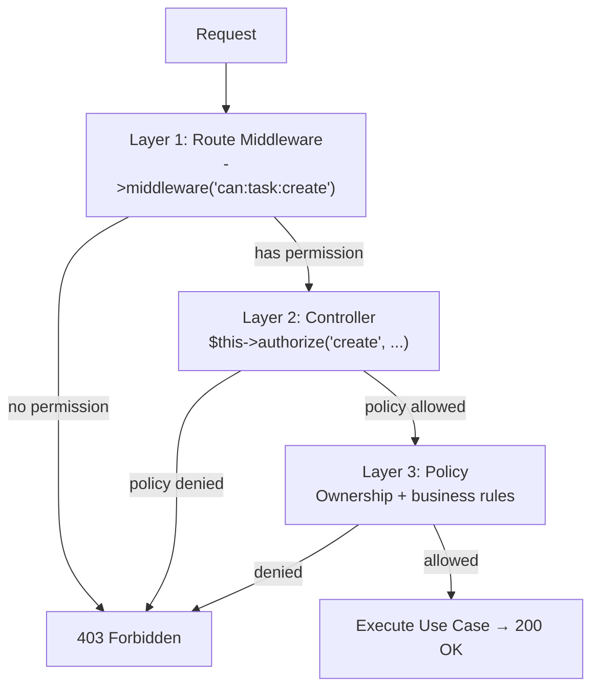
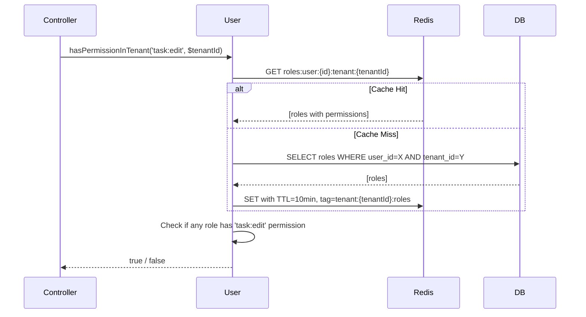

# Permission & RBAC — Architecture

**Status:** Approved
**Last Updated:** 2026-06-06

---

## System Overview



**Request lifecycle:** Route guard → Controller authorize → Policy (ownership check) → Use Case

---

## Data Model



**Key design choice:** `tenant_id` is stored directly on `roles` and `permissions` tables (Spatie extended). This makes tenant isolation explicit and queryable — no magic session scoping.

---

## 3-Layer Authorization



**Why 3 layers?** Defense in depth. If a developer forgets one layer, the others still catch it.

| Layer | Who checks | What it checks |
|---|---|---|
| Route middleware | Laravel's `can:` gate | User has the named permission in current tenant |
| Controller `authorize()` | Policy dispatch | Policy method for the action |
| Policy method | Business logic | Permission + ownership (e.g., `created_by == user_id`) |

---

## Permission Check Flow (with caching)



**Cache invalidation:** When a user's role changes, delete cache tag `tenant:{tenantId}:roles` — invalidates all users in that tenant atomically.

---

## Clean Architecture Integration

```
Presentation (Http/)
    Route          →  middleware('can:task:create')         [Layer 1]
    Controller     →  authorize('create', [Task::class])    [Layer 2]
    |
    v
Application (UseCases/)
    CreateTaskUseCase::execute(CreateTaskDTO, int $tenantId)
    [No permission checks here — only business logic]
    |
    v
Domain (Domain/)
    Policies/TaskPolicy    →  ownership + permission checks  [Layer 3]
    [Pure PHP — no Laravel facades]
    |
    v
Infrastructure (Infrastructure/)
    EloquentRoleRepository →  Spatie queries + Redis cache
```

> **Note:** Laravel Policies live in `app/Policies/` (not `app/Domain/`). They use Laravel's `Auth` facade, so they are Presentation-adjacent, not pure Domain. The Use Case does not invoke policies — the Controller does before calling the Use Case.

---

## Role Hierarchy

```
Owner  →  Admin  →  Manager  →  Member  →  Guest
 (all)    (most)   (moderate)   (own only)  (view)

Custom — future, admin-defined, not implemented in v1
```

Each role has a fixed permission set (defined in seeder). There is no automatic inheritance — every permission must be explicitly assigned per role in the seeder.

---

## Security Model

```
Threat: User A (Tenant 1) accesses Task in Tenant 2

Defense 1 — Route middleware
    Checks user has permission in session('current_tenant_id')

Defense 2 — Controller
    Passes tenantId explicitly: authorize('create', [Task::class, $tenantId])

Defense 3 — Policy
    Checks task->tenant_id matches the tenantId from Controller

Defense 4 — Repository query
    All queries scoped: ->where('tenant_id', $tenantId)

Result: Prevented — 4 independent checks, all must pass
```

---

## File Structure

```
app/
├── Models/
│   ├── Role.php              Extend SpatieRole — add scopeForTenant(), belongsToTenant()
│   ├── Permission.php        Extend SpatiePermission — add scopeForTenant()
│   └── User.php              Add rolesForTenant(), hasPermissionInTenant(), hasRoleInTenant()
│
├── Policies/
│   ├── TaskPolicy.php        viewAny, view, create, update, delete, updateStatus, assign
│   ├── ProjectPolicy.php     viewAny, view, create, update, delete
│   └── TenantPolicy.php      view, edit, delete, inviteUser, removeUser
│
├── Http/
│   ├── Controllers/Admin/
│   │   └── TaskController.php    (updated — add $this->authorize() calls)
│   └── Middleware/
│       └── (no new middleware needed — uses Laravel's built-in 'can:' gate)
│
└── Providers/
    └── AuthServiceProvider.php   Register Task/Project/Tenant policies

database/
├── migrations/
│   └── 2026_06_06_add_tenant_id_to_permission_tables.php
└── seeders/
    └── RolePermissionSeeder.php  6 roles × 25 permissions per tenant
```

---

## Technology Choices

| Component | Choice | Reason |
|---|---|---|
| Permission library | `spatie/laravel-permission` | Industry standard, integrates with Laravel Policies |
| Tenant scoping | Explicit `tenant_id` on Role/Permission models | Safety — no hidden state, easy to audit |
| Caching | Redis with tag-based invalidation | < 1ms hits, atomic tenant-level invalidation |
| Authorization | Laravel Policies | Convention, integrates with `authorize()` and `@can` |
