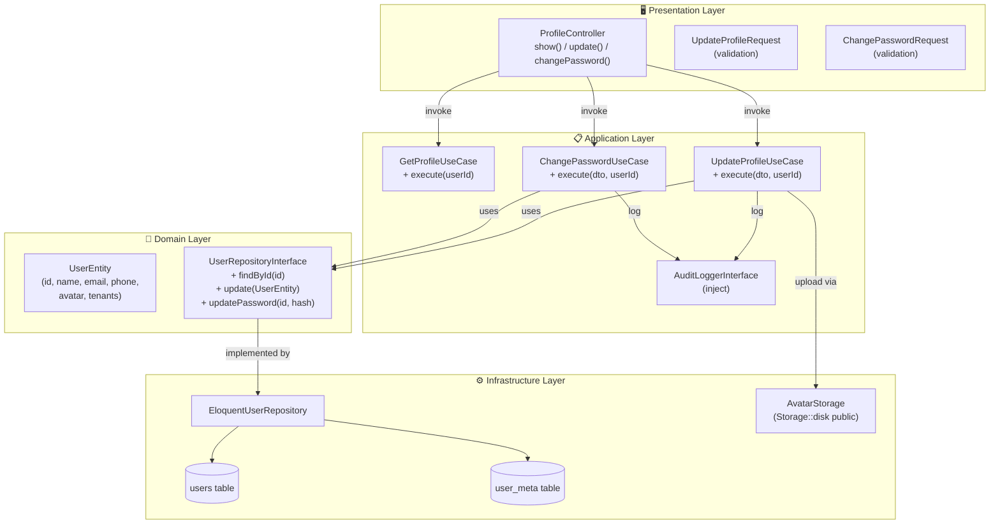
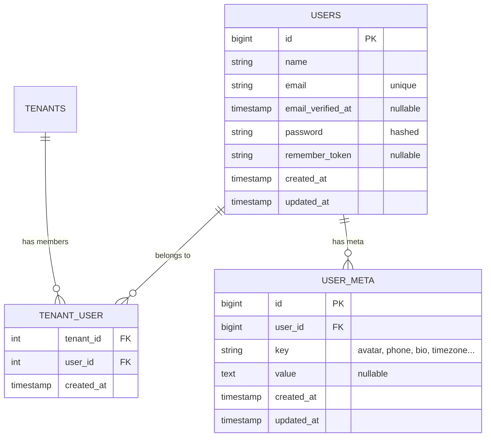
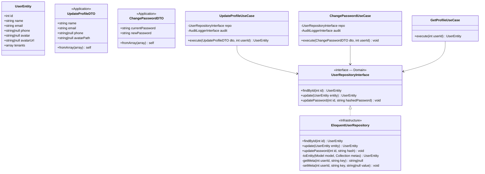
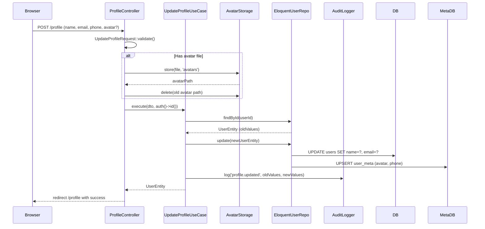
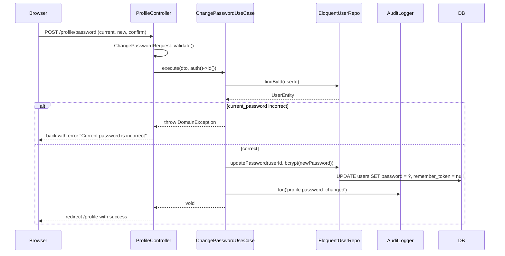
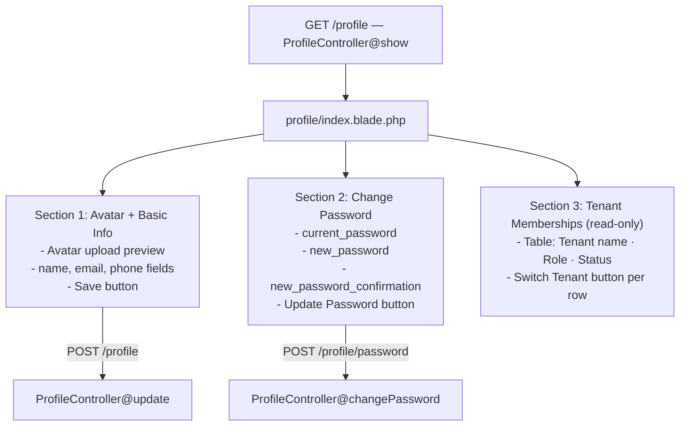
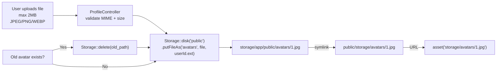
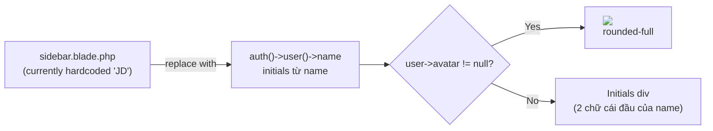

# User Profile — Architecture

---
Version: 1.0
Last Updated: 2026-06-06
Status: Draft
Author: Architecture Team
---

## System Overview



---

## Database Changes



**Migration cần tạo:** tạo bảng `user_meta` mới — bảng `users` không thay đổi.

**Unique constraint:** `(user_id, key)` — mỗi user chỉ có 1 record cho mỗi key.

---

## Clean Architecture Layer Mapping



---

## Flow — Update Profile



---

## Flow — Change Password



**Lưu ý:** `remember_token = null` để invalidate tất cả "Remember me" sessions khác.

---

## UI Layout



---

## Avatar Storage Strategy



**Avatar path được lưu vào `user_meta` với key `avatar`:**
```
user_meta: { user_id: 1, key: 'avatar', value: 'avatars/1.jpg' }
```

**Avatar URL helper trên UserEntity:**
```
avatarUrl = avatar != null
    ? asset('storage/' + avatar)
    : null  (caller dùng initials fallback)
```

`EloquentUserRepository::update()` gọi `setMeta($userId, 'avatar', $path)` sau khi lưu file.

---

## Sidebar Integration



---

## Route Structure

```
GET  /admin/profile              ProfileController@show          profile.show
POST /admin/profile              ProfileController@update        profile.update
POST /admin/profile/password     ProfileController@changePassword profile.password
```

**Không dùng `resource` route** vì Profile không có index/create/destroy — chỉ 3 endpoints.

---

## File Structure

```
app/
├── Domain/
│   └── User/
│       ├── Entities/
│       │   └── UserEntity.php
│       └── Repositories/
│           └── UserRepositoryInterface.php
│
├── Application/
│   └── User/
│       ├── DTOs/
│       │   ├── UpdateProfileDTO.php
│       │   └── ChangePasswordDTO.php
│       └── UseCases/
│           ├── GetProfileUseCase.php
│           ├── UpdateProfileUseCase.php
│           └── ChangePasswordUseCase.php
│
├── Infrastructure/
│   └── Persistence/Repositories/
│       └── EloquentUserRepository.php
│
└── Http/
    ├── Controllers/Admin/
    │   └── ProfileController.php          ← Tách riêng với UserController
    └── Requests/
        ├── UpdateProfileRequest.php
        └── ChangePasswordRequest.php

database/
└── migrations/
    └── 2026_06_06_100000_create_user_meta_table.php

app/Models/
└── UserMeta.php                               ← Eloquent model cho user_meta

resources/views/admin/pages/profile/
└── index.blade.php                        ← 3 sections layout

routes/web.php
└── 3 routes profile.*
```

---

## Security Checklist

```
✅ auth()->user() — không nhận userId từ request
✅ Avatar MIME validation server-side (không tin file extension)
✅ Avatar path sanitized — dùng userId làm filename
✅ Password không bao giờ được log trong audit
✅ remember_token = null khi đổi password (invalidate other sessions)
✅ current_password check trước khi cho đổi
✅ new_password min 8 ký tự
```

---

## Related Documents

- [01-REQUIREMENTS.md](./01-REQUIREMENTS.md) — Functional requirements
- [03-APPROACHES.md](./03-APPROACHES.md) — Các lựa chọn thiết kế
- [04-IMPLEMENTATION_PLAN.md](./04-IMPLEMENTATION_PLAN.md) — Build steps
