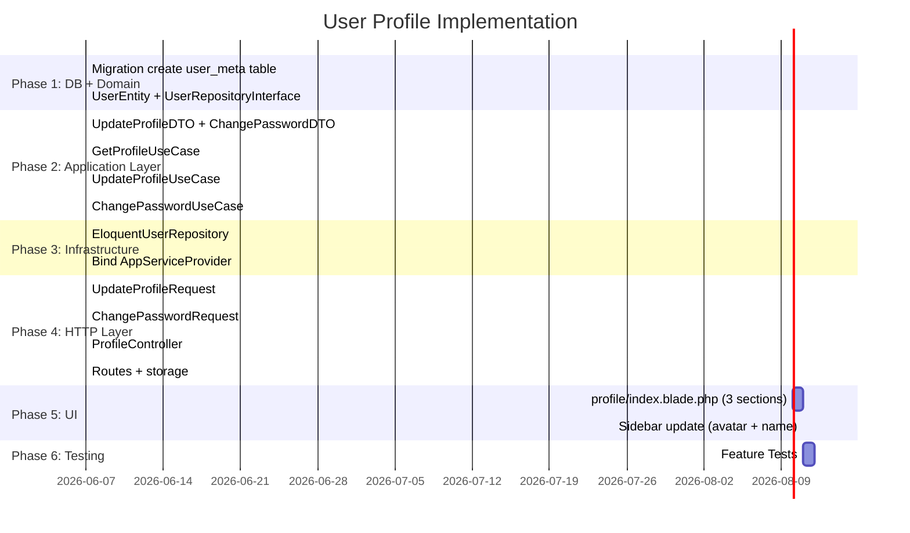

# User Profile — Implementation Plan

---
Version: 1.0
Last Updated: 2026-06-06
Status: Draft
Author: Architecture Team
---

## Phase Overview



---

## Phase 1: DB + Domain

### 1.1 Migration

**File:** `database/migrations/2026_06_06_100000_create_user_meta_table.php`

Bảng `users` **không thay đổi**. Tạo bảng mới `user_meta`:

```php
Schema::create('user_meta', function (Blueprint $table) {
    $table->id();
    $table->foreignId('user_id')->constrained()->cascadeOnDelete();
    $table->string('key', 100);
    $table->text('value')->nullable();
    $table->timestamps();

    $table->unique(['user_id', 'key']);  // 1 key per user
});
```

**UserMeta Eloquent Model** — `app/Models/UserMeta.php`

```php
class UserMeta extends Model
{
    protected $table    = 'user_meta';
    protected $fillable = ['user_id', 'key', 'value'];
}
```

### 1.2 UserEntity

**File:** `app/Domain/User/Entities/UserEntity.php`

```php
class UserEntity
{
    public function __construct(
        public readonly int     $id,
        public readonly string  $name,
        public readonly string  $email,
        public readonly ?string $phone,
        public readonly ?string $avatar,   // path: "avatars/1.jpg"
        public readonly ?string $avatarUrl, // full URL via asset()
        public readonly array   $tenants,  // [['id', 'name', 'slug', 'role']]
    ) {}
}
```

### 1.3 UserRepositoryInterface

**File:** `app/Domain/User/Repositories/UserRepositoryInterface.php`

```php
interface UserRepositoryInterface
{
    public function findById(int $id): UserEntity;
    public function update(UserEntity $entity): UserEntity;
    public function updatePassword(int $id, string $hashedPassword): void;
}
```

---

## Phase 2: Application Layer

### 2.1 DTOs

**File:** `app/Application/User/DTOs/UpdateProfileDTO.php`

```php
class UpdateProfileDTO
{
    public function __construct(
        public readonly string  $name,
        public readonly string  $email,
        public readonly ?string $phone,
        public readonly ?string $avatarPath,  // null nếu không upload
    ) {}

    public static function fromArray(array $data): self
    {
        return new self(
            name:       $data['name'],
            email:      $data['email'],
            phone:      $data['phone'] ?? null,
            avatarPath: $data['avatar_path'] ?? null,
        );
    }
}
```

**File:** `app/Application/User/DTOs/ChangePasswordDTO.php`

```php
class ChangePasswordDTO
{
    public function __construct(
        public readonly string $currentPassword,
        public readonly string $newPassword,
    ) {}

    public static function fromArray(array $data): self
    {
        return new self(
            currentPassword: $data['current_password'],
            newPassword:     $data['new_password'],
        );
    }
}
```

### 2.2 GetProfileUseCase

**File:** `app/Application/User/UseCases/GetProfileUseCase.php`

```php
class GetProfileUseCase
{
    public function __construct(
        private readonly UserRepositoryInterface $userRepository,
    ) {}

    public function execute(int $userId): UserEntity
    {
        return $this->userRepository->findById($userId);
    }
}
```

### 2.3 UpdateProfileUseCase

**File:** `app/Application/User/UseCases/UpdateProfileUseCase.php`

```php
class UpdateProfileUseCase
{
    public function __construct(
        private readonly UserRepositoryInterface $userRepository,
        private readonly AuditLoggerInterface    $audit,
    ) {}

    public function execute(UpdateProfileDTO $dto, int $userId): UserEntity
    {
        $existing = $this->userRepository->findById($userId);

        $oldValues = [
            'name'  => $existing->name,
            'email' => $existing->email,
            'phone' => $existing->phone,
        ];

        $updated = new UserEntity(
            id:        $existing->id,
            name:      $dto->name,
            email:     $dto->email,
            phone:     $dto->phone,
            avatar:    $dto->avatarPath ?? $existing->avatar,
            avatarUrl: null,   // repo sẽ tính lại
            tenants:   $existing->tenants,
        );

        $result = $this->userRepository->update($updated);

        $this->audit->log(
            action:     'profile.updated',
            entityId:   $userId,
            entityType: 'User',
            oldValues:  $oldValues,
            newValues:  ['name' => $dto->name, 'email' => $dto->email, 'phone' => $dto->phone],
        );

        return $result;
    }
}
```

### 2.4 ChangePasswordUseCase

**File:** `app/Application/User/UseCases/ChangePasswordUseCase.php`

```php
class ChangePasswordUseCase
{
    public function __construct(
        private readonly UserRepositoryInterface $userRepository,
        private readonly AuditLoggerInterface    $audit,
    ) {}

    public function execute(ChangePasswordDTO $dto, int $userId): void
    {
        // findById để lấy password hash cần check
        // Nhưng UserEntity không lưu password (security)
        // → Repository sẽ check hash internally
        $user = \App\Models\User::findOrFail($userId);

        if (! \Hash::check($dto->currentPassword, $user->password)) {
            throw new \DomainException('Current password is incorrect.');
        }

        $this->userRepository->updatePassword($userId, \Hash::make($dto->newPassword));

        $this->audit->log(
            action:     'profile.password_changed',
            entityId:   $userId,
            entityType: 'User',
        );
    }
}
```

> **Note:** `ChangePasswordUseCase` trực tiếp dùng `Hash::check()` vì đây là infrastructure concern nhỏ, không cần tạo riêng PasswordHasherInterface. Đây là pragmatic trade-off chấp nhận được.

---

## Phase 3: Infrastructure

### 3.1 EloquentUserRepository

**File:** `app/Infrastructure/Persistence/Repositories/EloquentUserRepository.php`

```php
class EloquentUserRepository implements UserRepositoryInterface
{
    public function findById(int $id): UserEntity
    {
        $user = \App\Models\User::with('tenants')->findOrFail($id);
        return $this->toEntity($user);
    }

    public function update(UserEntity $entity): UserEntity
    {
        $user = \App\Models\User::findOrFail($entity->id);
        $user->update([
            'name'  => $entity->name,
            'email' => $entity->email,
        ]);

        $this->setMeta($entity->id, 'phone',  $entity->phone);
        $this->setMeta($entity->id, 'avatar', $entity->avatar);

        return $this->toEntity($user->fresh('tenants'));
    }

    public function updatePassword(int $id, string $hashedPassword): void
    {
        \App\Models\User::where('id', $id)->update([
            'password'       => $hashedPassword,
            'remember_token' => null,  // invalidate other sessions
        ]);
    }

    private function getMeta(int $userId, string $key): ?string
    {
        return \App\Models\UserMeta::where('user_id', $userId)
            ->where('key', $key)
            ->value('value');
    }

    private function setMeta(int $userId, string $key, ?string $value): void
    {
        \App\Models\UserMeta::updateOrCreate(
            ['user_id' => $userId, 'key' => $key],
            ['value'   => $value],
        );
    }

    private function toEntity(\App\Models\User $model): UserEntity
    {
        $avatar  = $this->getMeta($model->id, 'avatar');
        $phone   = $this->getMeta($model->id, 'phone');

        $tenants = $model->tenants->map(fn($t) => [
            'id'   => $t->id,
            'name' => $t->name,
            'slug' => $t->slug,
            'role' => $model->rolesForTenant($t->id)->first()?->name ?? 'member',
        ])->toArray();

        return new UserEntity(
            id:        $model->id,
            name:      $model->name,
            email:     $model->email,
            phone:     $phone,
            avatar:    $avatar,
            avatarUrl: $avatar ? asset('storage/' . $avatar) : null,
            tenants:   $tenants,
        );
    }
}
```

### 3.2 AppServiceProvider Binding

```php
$this->app->bind(
    \App\Domain\User\Repositories\UserRepositoryInterface::class,
    \App\Infrastructure\Persistence\Repositories\EloquentUserRepository::class,
);
```

---

## Phase 4: HTTP Layer

### 4.1 UpdateProfileRequest

**File:** `app/Http/Requests/UpdateProfileRequest.php`

```php
public function rules(): array
{
    return [
        'name'   => ['required', 'string', 'min:2', 'max:100'],
        'email'  => ['required', 'email', Rule::unique('users')->ignore(auth()->id())],
        'phone'  => ['nullable', 'string', 'max:20'],
        'avatar' => ['nullable', 'image', 'mimes:jpeg,png,webp', 'max:2048'],
    ];
}
```

### 4.2 ChangePasswordRequest

**File:** `app/Http/Requests/ChangePasswordRequest.php`

```php
public function rules(): array
{
    return [
        'current_password'      => ['required', 'string'],
        'new_password'          => ['required', 'string', 'min:8', 'confirmed'],
        // new_password_confirmation tự validate bởi 'confirmed'
    ];
}
```

### 4.3 ProfileController

**File:** `app/Http/Controllers/Admin/ProfileController.php`

```php
class ProfileController extends Controller
{
    public function __construct(
        private readonly GetProfileUseCase      $getProfileUseCase,
        private readonly UpdateProfileUseCase   $updateProfileUseCase,
        private readonly ChangePasswordUseCase  $changePasswordUseCase,
    ) {}

    public function show()
    {
        try {
            $profile = $this->getProfileUseCase->execute(auth()->id());
            return view('admin.pages.profile.index', compact('profile'));
        } catch (\Exception $e) {
            Log::error($e->getMessage());
            return back()->with('error', 'Failed to load profile.');
        }
    }

    public function update(UpdateProfileRequest $request)
    {
        try {
            $avatarPath = null;

            if ($request->hasFile('avatar')) {
                $profile    = $this->getProfileUseCase->execute(auth()->id());
                $oldAvatar  = $profile->avatar;
                if ($oldAvatar) {
                    Storage::disk('public')->delete($oldAvatar);
                }
                $ext        = $request->file('avatar')->getClientOriginalExtension();
                $avatarPath = $request->file('avatar')
                    ->storeAs('avatars', auth()->id() . '.' . $ext, 'public');
            }

            $dto = UpdateProfileDTO::fromArray(
                array_merge($request->validated(), ['avatar_path' => $avatarPath])
            );

            $this->updateProfileUseCase->execute($dto, auth()->id());

            return redirect()->route('profile.show')->with('success', 'Profile updated successfully.');
        } catch (\DomainException $e) {
            return back()->with('error', $e->getMessage())->withInput();
        } catch (\Exception $e) {
            Log::error($e->getMessage());
            return back()->with('error', 'Failed to update profile.')->withInput();
        }
    }

    public function changePassword(ChangePasswordRequest $request)
    {
        try {
            $dto = ChangePasswordDTO::fromArray($request->validated());
            $this->changePasswordUseCase->execute($dto, auth()->id());

            return redirect()->route('profile.show')->with('success', 'Password changed successfully.');
        } catch (\DomainException $e) {
            return back()->with('error', $e->getMessage());
        } catch (\Exception $e) {
            Log::error($e->getMessage());
            return back()->with('error', 'Failed to change password.');
        }
    }
}
```

### 4.4 Routes

```php
// routes/web.php — trong middleware('auth') group
Route::get('/profile',          [ProfileController::class, 'show'])->name('profile.show');
Route::post('/profile',         [ProfileController::class, 'update'])->name('profile.update');
Route::post('/profile/password',[ProfileController::class, 'changePassword'])->name('profile.password');
```

```bash
# Chạy 1 lần để tạo symlink public/storage → storage/app/public
php artisan storage:link
```

---

## Phase 5: UI — Blade View

### Layout — 3 sections

**File:** `resources/views/admin/pages/profile/index.blade.php`

```
┌─────────────────────────────────────────────────────┐
│  Profile                                            │
├─────────────────────────────────────────────────────┤
│  Section 1: Basic Info                              │
│  ┌──────────┐  Name: [____________]                 │
│  │  Avatar  │  Email: [____________]                │
│  │  (click  │  Phone: [____________]                │
│  │  upload) │                       [Save Changes] │
│  └──────────┘                                       │
├─────────────────────────────────────────────────────┤
│  Section 2: Change Password                         │
│  Current Password: [____________]                   │
│  New Password:     [____________]                   │
│  Confirm:          [____________]                   │
│                         [Update Password]           │
├─────────────────────────────────────────────────────┤
│  Section 3: Tenant Memberships                      │
│  ┌─────────────┬──────────┬────────┬──────────┐    │
│  │ Tenant      │ Role     │ Status │          │    │
│  ├─────────────┼──────────┼────────┼──────────┤    │
│  │ Acme Corp   │ owner    │ Active │ [Switch] │    │
│  │ Dev Studio  │ member   │ Active │ [Switch] │    │
│  └─────────────┴──────────┴────────┴──────────┘    │
└─────────────────────────────────────────────────────┘
```

### Sidebar Update

Trong `sidebar.blade.php`, thay hardcoded "JD" bằng:

> **Lưu ý:** `auth()->user()` là Eloquent User model — không có `->avatar` trực tiếp nữa (avatar nằm trong `user_meta`). Dùng helper accessor trên User model hoặc đọc qua `UserMeta`:

```php
// app/Models/User.php — thêm accessor tiện lợi cho Blade
public function getAvatarAttribute(): ?string
{
    return \App\Models\UserMeta::where('user_id', $this->id)
        ->where('key', 'avatar')->value('value');
}
```

```blade
@php $authUser = auth()->user(); @endphp

@if($authUser->avatar)
    avatar) }}"
         class="w-10 h-10 rounded-full object-cover shadow" alt="avatar">
@else
    <div class="w-10 h-10 rounded-full bg-gradient-to-tr from-indigo-500 to-purple-600
                flex items-center justify-center text-white font-bold text-sm shadow">
        {{ strtoupper(substr($authUser->name, 0, 1)) }}{{ strtoupper(substr(strrchr($authUser->name, ' '), 1, 1)) }}
    </div>
@endif

<div class="flex-1 min-w-0">
    <p class="text-sm font-semibold text-slate-700 truncate">{{ $authUser->name }}</p>
    <p class="text-xs text-slate-400 truncate">{{ $authUser->email }}</p>
</div>
```

---

## Phase 6: Testing

### Test Cases

```
✓ authenticated user can view their profile
✓ can update name and email
✓ cannot use email already taken by another user
✓ can upload avatar — file stored correctly
✓ old avatar deleted when new one uploaded
✓ profile update writes audit log (profile.updated)
✓ can change password with correct current password
✓ cannot change password with wrong current password → DomainException
✓ changing password clears remember_token
✓ password change writes audit log (profile.password_changed)
✓ cannot view other user's profile (only own)
```

---

## Checklist Tổng

### Phase 1 — DB + Domain
- [ ] Migration `create_user_meta_table` + `php artisan migrate`
- [ ] `app/Models/UserMeta.php`
- [ ] `app/Domain/User/Entities/UserEntity.php`
- [ ] `app/Domain/User/Repositories/UserRepositoryInterface.php`

### Phase 2 — Application
- [ ] `app/Application/User/DTOs/UpdateProfileDTO.php`
- [ ] `app/Application/User/DTOs/ChangePasswordDTO.php`
- [ ] `app/Application/User/UseCases/GetProfileUseCase.php`
- [ ] `app/Application/User/UseCases/UpdateProfileUseCase.php`
- [ ] `app/Application/User/UseCases/ChangePasswordUseCase.php`

### Phase 3 — Infrastructure
- [ ] `app/Infrastructure/Persistence/Repositories/EloquentUserRepository.php`
- [ ] Binding trong `AppServiceProvider`

### Phase 4 — HTTP
- [ ] `app/Http/Requests/UpdateProfileRequest.php`
- [ ] `app/Http/Requests/ChangePasswordRequest.php`
- [ ] `app/Http/Controllers/Admin/ProfileController.php`
- [ ] 3 routes profile.* trong `routes/web.php`
- [ ] `php artisan storage:link`

### Phase 5 — UI
- [ ] `resources/views/admin/pages/profile/index.blade.php`
- [ ] Sidebar update — avatar + name thật
- [ ] Sidebar link đến `/profile`

### Phase 6 — Testing
- [ ] `tests/Feature/UserProfileTest.php` — 11+ test cases

---

## Related Documents

- [00-OVERVIEW.md](./00-OVERVIEW.md) — Problem statement, scope
- [01-REQUIREMENTS.md](./01-REQUIREMENTS.md) — Functional requirements
- [02-ARCHITECTURE.md](./02-ARCHITECTURE.md) — Diagrams, file structure
- [03-APPROACHES.md](./03-APPROACHES.md) — Decisions + lý do
