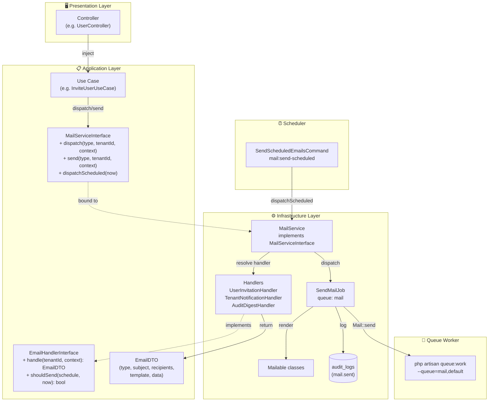
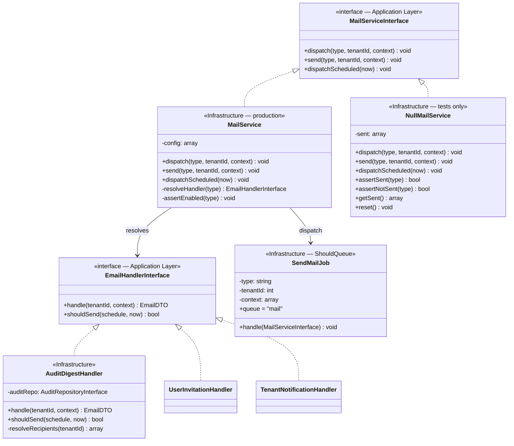
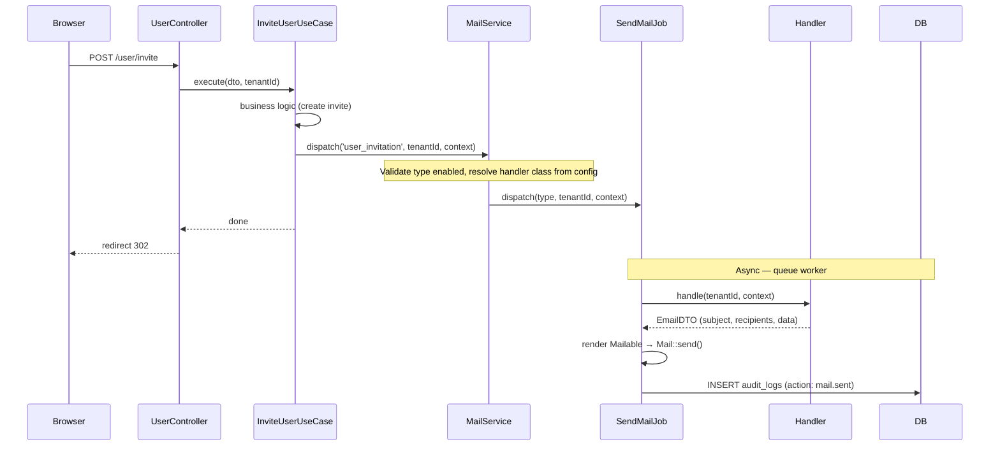
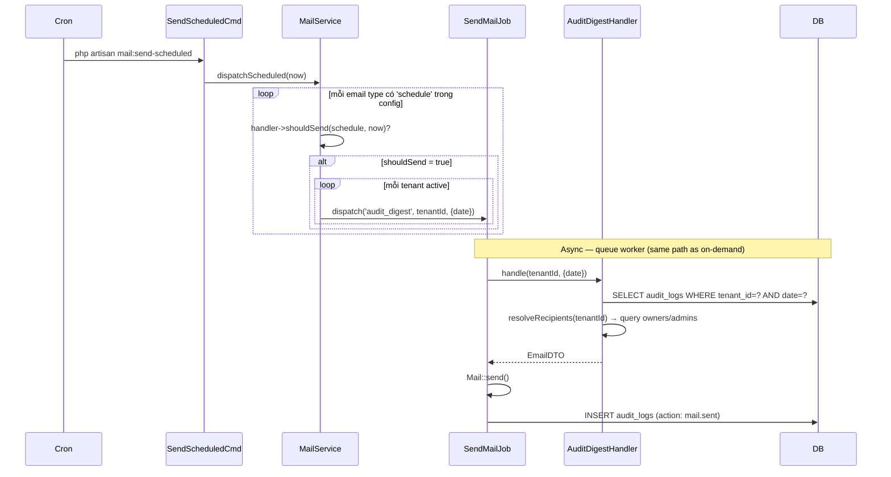

# Mail Service — Architecture

**Status:** Draft  
**Last Updated:** 2026-06-09

---

## System Overview



---

## Clean Architecture Layer Mapping

```
Domain/
    (không có layer này — Mail Service là Infrastructure concern)

Application/Mail/
    Contracts/
        MailServiceInterface.php     ← Use Cases inject interface này
        EmailHandlerInterface.php    ← contract cho từng Handler
    DTOs/
        EmailDTO.php                 ← data transfer từ Handler → Job

Infrastructure/Mail/
    MailService.php                  ← implements MailServiceInterface
    NullMailService.php              ← dùng trong tests
    Handlers/
        UserInvitationHandler.php    ← implements EmailHandlerInterface
        TenantNotificationHandler.php
        AuditDigestHandler.php
    Jobs/
        SendMailJob.php              ← ShouldQueue, queue='mail'
    Mailables/
        UserInvitationMailable.php
        TenantNotificationMailable.php
        AuditDigestMailable.php
    Commands/
        SendScheduledEmailsCommand.php

config/
    mail-service.php

resources/views/emails/
    user-invitation.blade.php
    tenant-notification.blade.php
    audit-digest.blade.php
```

---

## Class Design



**`NullMailService`** — dùng trong tests, không dispatch job thật, lưu in-memory cho assertions.  
Giống pattern `NullAuditLogger` của Audit System.

---

## Flow — On-Demand (User Invitation)



---

## Flow — Scheduled (Audit Digest)



---

## Multi-Tenant Recipients

Recipients **không** hardcode trong config. Handler tự resolve từ DB:

```
config/mail-service.php:
  audit_digest:
    handler: AuditDigestHandler   ← KHÔNG có 'recipients' key

AuditDigestHandler::handle($tenantId, $context):
  → query users WHERE tenant_id = $tenantId AND role IN ('owner', 'admin')
  → return EmailDTO với recipients = ['admin1@x.com', 'owner@x.com']
```

Mỗi tenant nhận email riêng với data riêng — đúng tenant isolation.

---

## AppServiceProvider Bindings

```php
// Giống AuditLoggerInterface pattern
$this->app->bind(
    \App\Application\Mail\Contracts\MailServiceInterface::class,
    \App\Infrastructure\Mail\MailService::class,
);
```

Trong tests:
```php
$this->app->bind(
    MailServiceInterface::class,
    NullMailService::class,
);
```

---

## Queue Architecture

```
HTTP Request (synchronous < 5ms)
    Use Case → MailServiceInterface::dispatch() → Queue::push(SendMailJob)

Queue Worker (asynchronous)
    SendMailJob::handle()
        → resolve handler → handle(tenantId, context) → EmailDTO
        → render Mailable
        → Mail::send()
        → INSERT audit_logs
```

```bash
# Worker ưu tiên queue 'mail' trước 'default'
php artisan queue:work --queue=mail,default
```

---

## Error Handling

| Scenario | Behavior |
|---|---|
| Email type không tồn tại trong config | Throw `InvalidArgumentException` — fail fast |
| Email type bị disabled | Return early, không throw — silent skip |
| Handler throw exception | Job fails → retry 3 lần → `failed_jobs` table |
| Mail facade fail (SMTP down) | Job fails → retry với backoff 60s |
| `MAIL_SERVICE_ENABLED=false` | Return early ở `MailService::dispatch()` |
