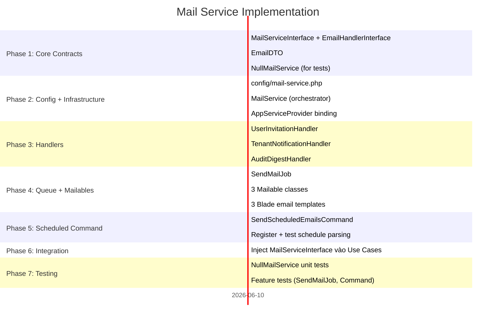

# Mail Service — Implementation Plan

**Status:** Draft  
**Last Updated:** 2026-06-09  
**Estimated Duration:** 10–14 hours

---

## Phase Overview



---

## Phase 1: Core Contracts (Application Layer)

**Nguyên tắc:** Application layer không có Laravel dependency. Chỉ pure PHP interfaces và DTOs.

### 1.1 MailServiceInterface

**File:** `app/Application/Mail/Contracts/MailServiceInterface.php`

```php
interface MailServiceInterface
{
    public function dispatch(string $type, int $tenantId, array $context = []): void;
    public function send(string $type, int $tenantId, array $context = []): void;
    public function dispatchScheduled(\Carbon\Carbon $now): void;
}
```

### 1.2 EmailHandlerInterface

**File:** `app/Application/Mail/Contracts/EmailHandlerInterface.php`

```php
interface EmailHandlerInterface
{
    public function handle(int $tenantId, array $context): EmailDTO;
    public function shouldSend(string $schedule, \Carbon\Carbon $now): bool;
}
```

### 1.3 EmailDTO

**File:** `app/Application/Mail/DTOs/EmailDTO.php`

```php
class EmailDTO
{
    public function __construct(
        public readonly string $type,
        public readonly string $subject,
        public readonly array  $recipients,
        public readonly string $template,
        public readonly array  $data = [],
    ) {}
}
```

### 1.4 NullMailService (Tests)

**File:** `app/Infrastructure/Mail/NullMailService.php`

```php
class NullMailService implements MailServiceInterface
{
    private array $sent = [];

    public function dispatch(string $type, int $tenantId, array $context = []): void
    {
        $this->sent[] = compact('type', 'tenantId', 'context');
    }

    public function send(string $type, int $tenantId, array $context = []): void
    {
        $this->sent[] = compact('type', 'tenantId', 'context');
    }

    public function dispatchScheduled(\Carbon\Carbon $now): void {}

    public function assertSent(string $type): bool
    {
        return collect($this->sent)->contains('type', $type);
    }

    public function assertNotSent(string $type): bool
    {
        return ! $this->assertSent($type);
    }

    public function getSent(): array { return $this->sent; }
    public function reset(): void   { $this->sent = []; }
}
```

---

## Phase 2: Config + MailService

### 2.1 Config File

**File:** `config/mail-service.php`

```php
return [
    'enabled' => env('MAIL_SERVICE_ENABLED', true),
    'queue'   => env('MAIL_SERVICE_QUEUE', 'mail'),

    'email_types' => [
        'user_invitation' => [
            'enabled'  => env('USER_INVITATION_ENABLED', true),
            'handler'  => \App\Infrastructure\Mail\Handlers\UserInvitationHandler::class,
            'template' => 'emails.user-invitation',
        ],
        'tenant_notification' => [
            'enabled'  => env('TENANT_NOTIFICATION_ENABLED', true),
            'handler'  => \App\Infrastructure\Mail\Handlers\TenantNotificationHandler::class,
            'template' => 'emails.tenant-notification',
        ],
        'audit_digest' => [
            'enabled'  => env('AUDIT_DIGEST_ENABLED', true),
            'schedule' => env('AUDIT_DIGEST_SCHEDULE', 'daily_08_00'),
            'handler'  => \App\Infrastructure\Mail\Handlers\AuditDigestHandler::class,
            'template' => 'emails.audit-digest',
        ],
    ],
];
```

### 2.2 MailService

**File:** `app/Infrastructure/Mail/MailService.php`

```php
class MailService implements MailServiceInterface
{
    public function dispatch(string $type, int $tenantId, array $context = []): void
    {
        if (! config('mail-service.enabled', true)) return;

        $this->assertTypeExists($type);
        $config = config("mail-service.email_types.{$type}");

        if (! ($config['enabled'] ?? true)) return;

        SendMailJob::dispatch($type, $tenantId, $context)
            ->onQueue(config('mail-service.queue', 'mail'));
    }

    public function send(string $type, int $tenantId, array $context = []): void
    {
        // Gọi thẳng handler + Mailable, không qua queue
        $handler = $this->resolveHandler($type);
        $dto     = $handler->handle($tenantId, $context);
        // ... render + Mail::send() ...
    }

    public function dispatchScheduled(\Carbon\Carbon $now): void
    {
        foreach (config('mail-service.email_types', []) as $type => $cfg) {
            if (empty($cfg['schedule']) || ! ($cfg['enabled'] ?? true)) continue;

            $handler = $this->resolveHandler($type);
            if (! $handler->shouldSend($cfg['schedule'], $now)) continue;

            // Dispatch cho từng tenant active
            \App\Models\Tenant::where('is_active', true)->each(
                fn($t) => $this->dispatch($type, $t->id, [])
            );
        }
    }

    private function resolveHandler(string $type): EmailHandlerInterface
    {
        $class = config("mail-service.email_types.{$type}.handler")
            ?? throw new \InvalidArgumentException("Unknown mail type: {$type}");

        return app($class);   // Laravel container tự inject dependencies
    }

    private function assertTypeExists(string $type): void
    {
        if (! config("mail-service.email_types.{$type}")) {
            throw new \InvalidArgumentException("Unknown mail type: {$type}");
        }
    }
}
```

### 2.3 AppServiceProvider Binding

```php
$this->app->bind(
    \App\Application\Mail\Contracts\MailServiceInterface::class,
    \App\Infrastructure\Mail\MailService::class,
);
```

---

## Phase 3: Handlers

Mỗi Handler: nhận `$tenantId` + `$context` → trả về `EmailDTO`.  
Handler tự resolve recipients từ DB — không nhận từ config.

### 3.1 AuditDigestHandler (quan trọng nhất)

**File:** `app/Infrastructure/Mail/Handlers/AuditDigestHandler.php`

```php
class AuditDigestHandler implements EmailHandlerInterface
{
    public function __construct(
        private readonly AuditRepositoryInterface $auditRepo,
    ) {}

    public function handle(int $tenantId, array $context): EmailDTO
    {
        $date    = $context['date'] ?? now()->subDay()->toDateString();
        $logs    = $this->auditRepo->getByTenantAndDate($tenantId, $date);
        $recipients = $this->resolveAdminEmails($tenantId);

        return new EmailDTO(
            type:       'audit_digest',
            subject:    "Audit Digest — {$date}",
            recipients: $recipients,
            template:   'emails.audit-digest',
            data:       ['logs' => $logs, 'date' => $date, 'tenant_id' => $tenantId],
        );
    }

    public function shouldSend(string $schedule, Carbon $now): bool
    {
        // Parse 'daily_08_00' → run at 08:00 UTC daily
        [$_, $hour, $minute] = explode('_', $schedule);
        return $now->hour === (int) $hour && $now->minute === (int) $minute;
    }

    private function resolveAdminEmails(int $tenantId): array
    {
        return \App\Models\User::whereHas('tenants', fn($q) => $q->where('tenants.id', $tenantId))
            ->get()
            ->filter(fn($u) => $u->isAdminOfTenant($tenantId))
            ->pluck('email')
            ->toArray();
    }
}
```

### 3.2 UserInvitationHandler

**File:** `app/Infrastructure/Mail/Handlers/UserInvitationHandler.php`

Recipients lấy từ `$context['invited_email']` — không cần query DB.

### 3.3 TenantNotificationHandler

**File:** `app/Infrastructure/Mail/Handlers/TenantNotificationHandler.php`

Recipients = owner + admin của tenant (tương tự `AuditDigestHandler::resolveAdminEmails()`).

---

## Phase 4: Queue Job + Mailables

### 4.1 SendMailJob

**File:** `app/Infrastructure/Mail/Jobs/SendMailJob.php`

```php
class SendMailJob implements ShouldQueue
{
    use Dispatchable, InteractsWithQueue, Queueable;

    public int    $tries   = 3;
    public int    $backoff = 60;

    public function __construct(
        private readonly string $type,
        private readonly int    $tenantId,
        private readonly array  $context,
    ) {
        $this->onQueue(config('mail-service.queue', 'mail'));
    }

    public function handle(MailServiceInterface $mailService): void
    {
        // Gọi send() sync vì đã trong queue worker
        $mailService->send($this->type, $this->tenantId, $this->context);
    }
}
```

### 4.2 Mailable Classes (3 files)

Pattern chung:

```php
class UserInvitationMailable extends Mailable
{
    public function __construct(private readonly EmailDTO $dto) {}

    public function envelope(): Envelope
    {
        return new Envelope(subject: $this->dto->subject);
    }

    public function content(): Content
    {
        return new Content(
            view: $this->dto->template,
            with: $this->dto->data,
        );
    }
}
```

### 4.3 Blade Templates

```
resources/views/emails/
├── user-invitation.blade.php      ← link chấp nhận, tên người mời, tên tenant
├── tenant-notification.blade.php  ← event type, mô tả, actor
└── audit-digest.blade.php         ← table log: time · user · action · entity
```

---

## Phase 5: Scheduled Command

**File:** `app/Infrastructure/Mail/Commands/SendScheduledEmailsCommand.php`

```php
class SendScheduledEmailsCommand extends Command
{
    protected $signature   = 'mail:send-scheduled {--now= : Override current time (testing)}';
    protected $description = 'Dispatch scheduled email jobs for current time';

    public function handle(MailServiceInterface $mailService): void
    {
        $now = $this->option('now')
            ? Carbon::parse($this->option('now'))
            : Carbon::now('UTC');

        $mailService->dispatchScheduled($now);

        $this->info("Scheduled emails dispatched for {$now->toDateTimeString()} UTC");
    }
}
```

Đăng ký trong `routes/console.php`:
```php
Schedule::command('mail:send-scheduled')->everyMinute();
```

> Chạy mỗi phút — `shouldSend()` trong handler tự lọc đúng thời điểm. Không cần cron phức tạp.

---

## Phase 6: Integration — Inject vào Use Cases

Các Use Cases cần gửi mail thêm `MailServiceInterface` vào constructor:

```php
class InviteUserUseCase
{
    public function __construct(
        private readonly UserRepositoryInterface $userRepo,
        private readonly AuditLoggerInterface    $audit,
        private readonly MailServiceInterface    $mail,   // ← thêm
    ) {}

    public function execute(InviteUserDTO $dto, int $tenantId): void
    {
        // ... create invite ...

        $this->mail->dispatch('user_invitation', $tenantId, [
            'invited_email' => $dto->email,
            'invited_by'    => authContext()->getUser()->name,
            'tenant_name'   => $dto->tenantName,
        ]);

        $this->audit->log('tenant.user_invited', $tenantId, 'Tenant',
            metadata: ['invited_email' => $dto->email]);
    }
}
```

---

## Phase 7: Testing

### Test với NullMailService

```php
// Trong TestCase base hoặc test cụ thể
$this->app->bind(MailServiceInterface::class, NullMailService::class);

// Assert
$null = app(NullMailService::class);
$this->assertTrue($null->assertSent('user_invitation'));
$this->assertFalse($null->assertSent('audit_digest'));
```

### Test Cases cần có

```
✓ dispatch('user_invitation') → job được push vào queue 'mail'
✓ dispatch('invalid_type')    → throw InvalidArgumentException
✓ dispatch khi disabled       → không dispatch, không throw
✓ SendMailJob::handle()       → handler được gọi → Mailable rendered → Mail::send()
✓ AuditDigestHandler          → recipients = admin/owner của tenant, không tenant khác
✓ mail:send-scheduled --now=08:00 → audit_digest được dispatch
✓ mail:send-scheduled --now=10:00 → audit_digest không dispatch
✓ Mỗi lần send → INSERT audit_logs action=mail.sent
```

---

## File Checklist

### Phase 1 — Contracts
- [ ] `app/Application/Mail/Contracts/MailServiceInterface.php`
- [ ] `app/Application/Mail/Contracts/EmailHandlerInterface.php`
- [ ] `app/Application/Mail/DTOs/EmailDTO.php`
- [ ] `app/Infrastructure/Mail/NullMailService.php`

### Phase 2 — Config + Core
- [ ] `config/mail-service.php`
- [ ] `app/Infrastructure/Mail/MailService.php`
- [ ] Binding trong `AppServiceProvider`

### Phase 3 — Handlers
- [ ] `app/Infrastructure/Mail/Handlers/UserInvitationHandler.php`
- [ ] `app/Infrastructure/Mail/Handlers/TenantNotificationHandler.php`
- [ ] `app/Infrastructure/Mail/Handlers/AuditDigestHandler.php`

### Phase 4 — Queue + Mailables
- [ ] `app/Infrastructure/Mail/Jobs/SendMailJob.php`
- [ ] `app/Infrastructure/Mail/Mailables/UserInvitationMailable.php`
- [ ] `app/Infrastructure/Mail/Mailables/TenantNotificationMailable.php`
- [ ] `app/Infrastructure/Mail/Mailables/AuditDigestMailable.php`
- [ ] `resources/views/emails/user-invitation.blade.php`
- [ ] `resources/views/emails/tenant-notification.blade.php`
- [ ] `resources/views/emails/audit-digest.blade.php`

### Phase 5 — Command
- [ ] `app/Infrastructure/Mail/Commands/SendScheduledEmailsCommand.php`
- [ ] Register trong `routes/console.php`

### Phase 6 — Integration
- [ ] Inject `MailServiceInterface` vào `InviteUserUseCase` (hoặc Use Case tương đương)

### Phase 7 — Tests
- [ ] `tests/Unit/Mail/NullMailServiceTest.php`
- [ ] `tests/Unit/Mail/AuditDigestHandlerTest.php`
- [ ] `tests/Feature/Mail/SendMailJobTest.php`
- [ ] `tests/Feature/Mail/SendScheduledEmailsCommandTest.php`
